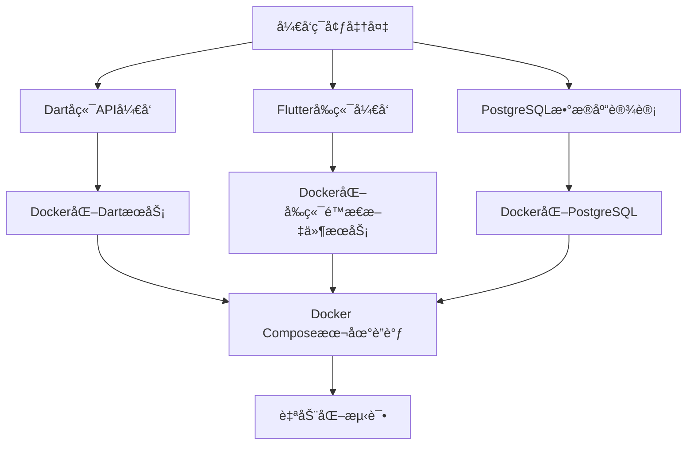
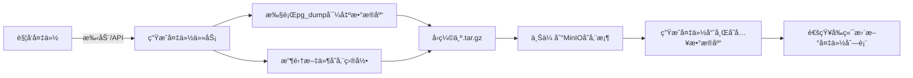

技术栈：Dart å端ã€Flutter å‰ç«¯ã€PostgreSQL æ•°æ®åº“ã€Nginx 代ç†ï¼Œç„¶å通过 Docker å’Œ MicroK8s 部署

有ç°ä»£ UI，比如使用 Flutter 的动画效æœï¼Œå端有å®æ—¶é€šä¿¡ï¼ˆWebSocket 或 Socket.IO），数æ®å¯è§†åŒ–用图表库，备份功能集æˆåˆ°åº”用内，一键导出/导入，甚至支æŒäº‘存储（如 Dropboxã€Google Drive）。

考虑到用户的技术栈，Dart çš„ Flutter å‰ç«¯å¯ä»¥å±•ç¤ºæ¼‚亮的界é¢ï¼Œå端用 Dart çš„ shelf 或 fast_api（虽然用户å¯èƒ½æ›´ç†Ÿæ‚‰ Dart），但需è¦ç¡®ä¿å端能处ç†å®æ—¶æ•°æ®ã€‚æ•°æ®åº“用 PostgreSQL，备份功能å¯ä»¥é€šè¿‡å®šæœŸä»»åŠ¡ï¼ˆDocker Compose + Cron 或 K8s Jobï¼‰ç”Ÿæˆ SQL 备份文件，用户å¯ä»¥é€šè¿‡å‰ç«¯è§¦å‘备份并下载。

å¯èƒ½çš„方案：一个“个人数æ®ä¸­å¿ƒâ€åº”用，用户å¯ä»¥ç®¡ç†ç¬”è®°ã€ä»»åŠ¡ã€æ•°æ®é›†ï¼Œå®æ—¶å作，数æ®å¯è§†åŒ–ï¼Œè‡ªåŠ¨åŒ–å¤‡ä»½ï¼Œç”šè‡³é›†æˆ AI 功能（如用 Hugging Face API 进行文本生æˆï¼‰ã€‚或者åšä¸€ä¸ªå®æ—¶æ•°æ®çœ‹æ¿ï¼Œå±•ç¤ºç”¨æˆ·çš„å„ç§æ•°æ®ï¼Œå¦‚ GitHub 活动ã€å¤©æ°”ã€æ–°é—»ï¼Œå¹¶é€šè¿‡è‡ªåŠ¨åŒ–脚本生æˆæŠ¥å‘Šã€‚

需è¦ç¡®ä¿åº”用的结æ„清晰，å„组件通过 Docker 容器化，用 MicroK8s 部署，展示容器编æ’的能力。备份功能å¯ä»¥è®¾è®¡æˆå®šæœŸç”Ÿæˆæ•°æ®åº“备份，用户在å‰ç«¯é€‰æ‹©å¤‡ä»½æ—¶é—´æˆ–手动触å‘，然å下载å‹ç¼©åŒ…。导入时上传å‹ç¼©åŒ…æ¢å¤æ•°æ®ã€‚

最å，è¦æ醒用户关注安全性，比如数æ®åº“访问æƒé™ã€å¤‡ä»½æ–‡ä»¶çš„加密，以åŠå¦‚何通过K8sçš„æŒä¹…化存储（如PersistentVolume）æ¥å¢å¼ºæ•°æ®æŒä¹…化，而ä¸ä»…仅是ä¾èµ–备份文件。这样应用会更专业，也符åˆè£…逼的需求。

炫酷的部分å¯ä»¥åŒ…括：动æ€ä»ªè¡¨ç›˜ã€å®æ—¶èŠå¤©åŠŸèƒ½ï¼ˆWebSocket）ã€ç”¨æˆ·è‡ªå®šä¹‰ä¸»é¢˜ã€æ•°æ®å¯è§†åŒ–图表ã€è‡ªåŠ¨åŒ–报告生æˆï¼ˆPDF 或 HTML），甚至集æˆæœºå™¨å­¦ä¹ æ¨¡å‹è¿›è¡Œæ•°æ®åˆ†æ。

总结下æ¥ï¼Œæ¨è一个“个人智能数æ®ç®¡ç†å¹³å°â€ï¼Œå…·å¤‡ä»¥ä¸‹åŠŸèƒ½ï¼š
> 1. 用户注册/登录（JWT 认è¯ï¼‰
> 2. 多类å‹æ•°æ®å­˜å‚¨ï¼ˆç¬”è®°ã€ä»»åŠ¡ã€æ–‡ä»¶ï¼‰
> 3. å®æ—¶å作（WebSocket）
> 4. æ•°æ®å¯è§†åŒ–（ECharts 或类似库）
> 5. è‡ªåŠ¨åŒ–å¤‡ä»½ï¼ˆå®šæœŸç”Ÿæˆ SQL 文件，支æŒå¯¼å‡º/导入）
> 6. 个性化主题（用户自定义 UI）
> 7. 集æˆç¬¬ä¸‰æ–¹ API（天气ã€æ–°é—»ã€GitHub）
> 8. AI 辅助（如自动生æˆæŠ¥å‘Šæ‘˜è¦ï¼‰

### **应用å称：** **“NeuraHubâ€**  
**标语：** *Your Personal Data Nexus – Where Intelligence Meets Convenience*  
**核心功能：**  
1. **全栈能力展示**（Dart + Flutter + PostgreSQL + Docker + MicroK8s）  
2. **å®æ—¶æ•°æ®ä¸­æ¢**（动æ€çœ‹æ¿ã€è‡ªåŠ¨åŒ–任务）  
3. **炫酷交互**（3D æ•°æ®å¯è§†åŒ–ã€ä¸»é¢˜åˆ‡æ¢ã€AI 辅助）  
4. **æŒä¹…化备份**（一键导出/导入ã€äº‘端åŒæ­¥ï¼‰  
5. **å¯æ‰©å±•æ€§**（æ’件化æ¶æ„ã€ç¬¬ä¸‰æ–¹ API 集æˆï¼‰

---

### **技术亮点ä¸â€œè£…逼â€ç‚¹**  
| åŠŸèƒ½æ¨¡å—           | 技术å®ç°                                                                 | 装逼指数（满分10） | å±•ç¤ºæ•ˆæœ                                                                 |
|--------------------|--------------------------------------------------------------------------|--------------------|--------------------------------------------------------------------------|
| **全栈容器化**     | 所有组件（Dart APIã€Flutter å‰ç«¯ã€PostgreSQLã€Nginx）通过 Docker é•œåƒéƒ¨ç½²ï¼ŒMicroK8s 管ç†é›†ç¾¤ | 9                  | 展示 `microk8s kubectl get pods` 的输出，è¯æ˜å®¹å™¨ç¼–æ’能力               |
| **å®æ—¶æ•°æ®çœ‹æ¿**   | Flutter åŠ¨æ€ 3D å¯è§†åŒ–（用 `fl_chart` 或 `three_dart` 库）+ å®æ—¶æ•°æ®æµï¼ˆWebSocket） | 8                  | 展示å®æ—¶è‚¡ç¥¨/天气数æ®æµ + 3D 折线图，çªå‡ºâ€œåŠ¨æ€â€å’Œâ€œå®æ—¶â€                |
| **AI 辅助助手**   | Dart 调用 Hugging Face API å®ç°æ–‡æœ¬ç”Ÿæˆï¼ˆå¦‚总结笔记ã€ç”ŸæˆæŠ¥å‘Šï¼‰               | 10                 | 输入“写一首诗â€ï¼Œåç«¯è¿”å› AI 生æˆå†…容，展示“智能â€èƒ½åŠ›                     |
| **主题引æ“**       | Flutter 动æ€ä¸»é¢˜åˆ‡æ¢ï¼ˆCSS å˜é‡ + JSON é…置文件）                           | 7                  | 点击按钮切æ¢â€œæš—黑模å¼â€/“霓虹模å¼â€ï¼Œç•Œé¢ç¬é—´å˜åŒ–，çªå‡ºâ€œå®šåˆ¶åŒ–†            |
| **自动化备份**     | PostgreSQL 定时备份（Docker + `pg_dump`） + Flutter å‰ç«¯ä¸€é”®å¯¼å‡º ZIP       | 9                  | 展示备份文件生æˆè¿›åº¦æ¡ï¼Œæ”¯æŒé‚®ä»¶é€šçŸ¥ï¼ˆé›†æˆ SendGrid API）                 |
| **æ’件市场**       | 微软å¼æ’件æ¶æ„（通过 Docker é•œåƒæ‰©å±•åŠŸèƒ½ï¼Œå¦‚“GitHub 监æ§æ’件â€ï¼‰             | 8                  | 展示如何通过 MicroK8s 部署新æ’件，çªå‡ºâ€œå¯æ‰©å±•æ€§â€                       |

---

### **详细功能拆解ä¸å®ç°è·¯å¾„**

#### **1. 核心模å—：数æ®ä¸­æ¢çœ‹æ¿**  
**技术栈：**  
- **å‰ç«¯ï¼š** Flutter + `fl_chart`（3D 图表） + `provider`（状æ€ç®¡ç†ï¼‰  
- **å端：** Dart + `shelf`（Web 框æ¶ï¼‰ + `postgres`（数æ®åº“驱动）  
- **æ•°æ®åº“：** PostgreSQL + `pg_dump`（备份工具）  
- **炫酷点：**  
  - å®æ—¶æ•°æ®æµï¼ˆWebSocket）：展示股票价格ã€å¤©æ°”ã€GitHub æ交活动  
  - 3D æ•°æ®å¯è§†åŒ–：用 `three_dart` åº“ç»˜åˆ¶æ—‹è½¬çš„åœ°çƒ + å…¨çƒå¤©æ°”热力图  
  - AI 生æˆæŠ¥å‘Šï¼šç”¨æˆ·é€‰æ‹©æ—¶é—´æ®µï¼ŒDart 调用 Hugging Face API ç”Ÿæˆ Markdown æ ¼å¼åˆ†æ报告  

**演示场景：**  
用户登录å，看æ¿è‡ªåŠ¨åŠ è½½ä»¥ä¸‹æ•°æ®ï¼š  
- å®æ—¶è‚¡ç¥¨ä»·æ ¼ï¼ˆé›†æˆ Alpha Vantage API）  
- å…¨çƒå¤©æ°”热力图（3D 地çƒæ¸²æŸ“）  
- GitHub æ交统计（通过 GitHub API è·å–用户数æ®ï¼‰  
- AI 生æˆçš„“本周数æ®æ´å¯Ÿâ€æŠ¥å‘Šï¼ˆPDF 下载）  

---

#### **2. æŒä¹…化备份系统**  
**技术栈：**  
- **备份生æˆï¼š** PostgreSQL + `pg_dump`ï¼ˆç”Ÿæˆ SQL 文件） + `tar` å‹ç¼©  
- **å‰ç«¯é›†æˆï¼š** Flutter + `http` 包（调用å端备份 API）  
- **炫酷点：**  
  - **“时间胶囊â€åŠŸèƒ½ï¼š** 用户å¯é€‰æ‹©å¤‡ä»½æ—¶é—´èŒƒå›´ï¼ˆå¦‚“2023-10-01 至 2023-10-31â€ï¼‰ï¼Œç”Ÿæˆå¸¦æ—¶é—´æˆ³çš„ ZIP 文件  
  - **æ¢å¤å‘导：** 上传 ZIP 文件å，自动校验 MD5 值并æ¢å¤æ•°æ®åº“  
  - **云端åŒæ­¥ï¼š** é›†æˆ Dropbox API，一键上传备份到云端（å¯é€‰ï¼‰  

**Dockerfile 片例（备份æœåŠ¡ï¼‰ï¼š**  
```dockerfile
# 备例：PostgreSQL 备份æœåŠ¡
FROM alpine:latest
RUN apk add postgresql-client tar
COPY backup.sh /backup.sh
CMD ["sh", "-c", "while true; do pg_dump -U youruser -d yourdb > /backup/$(date +%Y%m%d_%H%M%S).sql && tar -czvf /backup/$(date +%Y%m%d_%H%M%S).tar.gz /backup/*.sql && rm /backup/*.sql; sleep 3600; done"]
```

---

#### **3. 主题引æ“ä¸æ’件系统**  
**技术栈：**  
- **主题切æ¢ï¼š** Flutter 动æ€ä¸»é¢˜ï¼ˆ`MaterialColor` + `ThemeProvider`）  
- **æ’件æ¶æ„：**  
  - å端：Dart æ’件æ¥å£ï¼ˆå®šä¹‰ `loadPlugin` 方法）  
  - å‰ç«¯ï¼šæ’件å¡ç‰‡å¸ƒå±€ï¼ˆ`ListView` 动æ€åŠ è½½ï¼‰  
- **炫酷点：**  
  - **“暗物质模å¼â€ï¼š** 点击åç•Œé¢åˆ‡æ¢ä¸ºå…¨é»‘ + ç²’å­ç‰¹æ•ˆï¼ˆç”¨ Flutter çš„ `particles` 库）  
  - **æ’件商店：** 用户å¯å®‰è£…社区æ’件（如“天气预报æ’件â€ã€â€œGitHub 监æ§æ’件â€ï¼‰  

**æ’件示例（GitHub 监æ§æ’件）：**  
```dart
// æ’件æ¥å£
abstract class NeuraPlugin {
  Future<void> initialize();
  Widget buildWidget(BuildContext context);
}

// å®ç°ç±»
class GitHubPlugin implements NeuraPlugin {
  @override
  Future<void> initialize() async {
    // 调用 GitHub API è·å–用户仓库数æ®
  }

  @override
  Widget buildWidget(BuildContext context) {
    return Column(
      children: [
        Text("Your GitHub Stats:"),
        // 显示仓库数é‡ã€æœ€è¿‘æ交等
      ],
    );
  }
}
```

---

#### **4. 容器化ä¸éƒ¨ç½²ï¼ˆMicroK8s 集群）**  
**æ¶æ„图：**  
```
+-------------------+       +-------------------+
| Flutter å‰ç«¯å®¹å™¨   |       | Nginx 代ç†å®¹å™¨   |
| (Dart + Flutter)   |       | (é™æ€æ–‡ä»¶ + åå‘代ç†) |
+-------------------+       +-------------------+
       |                                   |
       | HTTP 请求                          | åå‘代ç†
       v                                   v
+-------------------+       +-------------------+
| Dart API 容器     |       | PostgreSQL 容器   |
| (shelf + WebSocket) |       | (定期备份任务)     |
+-------------------+       +-------------------+
       |
       | WebSocket æ•°æ®æµ
       v
+-------------------+
| AI 辅助容器       |
| (Dart + Hugging Face API) |
+-------------------+
```

**部署步骤：**  
1. **编写 Dockerfile：**  
   - 为æ¯ä¸ªæœåŠ¡ï¼ˆå‰ç«¯ã€å端ã€æ•°æ®åº“ã€Nginx）编写 Dockerfile  
   - 示例（Dart API）：  
     ```dockerfile
     FROM dart:3.3.0
     WORKDIR /app
     COPY pubspec.yaml .
     RUN dart pub get
     COPY . .
     CMD ["dart", "run", "main.dart"]
     ```

2. **编写 K8s é…置（YAML）：**  
   ```yaml
   # deployment.yaml
   apiVersion: apps/v1
   kind: Deployment
   metadata:
     name: neurahub-api
   spec:
     replicas: 3  # 自动扩缩容演示
     selector:
       matchLabels:
         app: neurahub-api
     template:
       metadata:
         labels:
           app: neurahub-api
       spec:
         containers:
         - name: api
           image: yourdockerhub/neurahub-api:latest
           ports:
           - containerPort: 8080
           env:
             - name: DB_HOST
               value: postgres
   ```

3. **一键部署脚本：**  
   ```bash
   #!/bin/bash
   microk8s kubectl apply -f deployment.yaml
   microk8s kubectl expose deployment neurahub-api --type=NodePort --port=80
   ```

---

### **如何“装逼â€æ¼”示？**  
**场景 1：全栈能力展示**  
- **æ“作：**  
  1. 打开终端：`microk8s kubectl get pods --watch`  
  2. 展示容器集群å®æ—¶çŠ¶æ€ï¼ˆ3 个 API Pod 自动扩容）  
  3. 在 Flutter 端点击“å¯åŠ¨ç²’å­ç‰¹æ•ˆâ€ï¼Œåç«¯è¿”å› WebSocket 指令，å‰ç«¯ç•Œé¢ç¬é—´å˜åŒ–  

**场景 2：AI 辅助ä¸å¤‡ä»½**  
- **æ“作：**  
  1. 用户输入“生æˆå¹´åº¦æŠ¥å‘Šâ€ï¼Œå端调用 Hugging Face APIï¼Œè¿”å› PDF 预览  
  2. 点击“一键备份â€ï¼Œåç«¯ç”Ÿæˆ ZIP 文件，å‰ç«¯ä¸‹è½½å¹¶æ˜¾ç¤ºå“ˆå¸Œå€¼æ ¡éªŒ  

**场景 3：主题ä¸æ’件**  
- **æ“作：**  
  1. 切动切æ¢ä¸»é¢˜ï¼ˆä»â€œæ简白â€åˆ°â€œæš—黑模å¼â€ï¼‰  
  2. 安装“GitHub 监æ§æ’件â€ï¼Œå®æ—¶æ˜¾ç¤ºä½ çš„仓库活动  

---

### **学习资æºæ¨è**  
1. **Dart å端速æˆï¼š**  
   - [Dart for Backend Developers](https://dart.dev/guides/backend)  
   - 书ç±ï¼šã€ŠDart in Action》（涵盖高级主题如 WebSocket）  

2. **Flutter 交互设计：**  
   - [Flutter 动æ€å›¾è¡¨æ•™ç¨‹](https://pub.dev/packages/fl_chart)  
   - 案例：[3D 地çƒæ¸²æŸ“示例](https://github.com/fluttercommunity/flutter_earth)  

3. **MicroK8s 高级ç©æ³•ï¼š**  
   - 官方文档：[MicroK8s Operator](https://microk8s.io/docs/operator)（学习自定义 Operator å¼€å‘）  
   - 部署监æ§ï¼š`microk8s enable metrics-server` + Prometheus  

4. **“装逼â€è®¾è®¡æŠ€å·§ï¼š**  
   - [Flutter 动æ€ç²’å­æ•ˆæœ](https://pub.dev/packages/particles)  
   - [Hugging Face API æ•´åˆæ•™ç¨‹](https://huggingface.co/docs/api-inference)  

---

### **项目路线图**  
| 阶段   | 目标                          | 里程碑æˆæœ                          | 时间预估  |
|--------|-------------------------------|--------------------------------------|-----------|
| 1 周   | å®ç°åŸºç¡€åŠŸèƒ½ï¼ˆAPI + æ•°æ®åº“）  | å¯è¿è¡Œçš„çš„ Docker Compose 集群 + 基础备份功能 | 2-3 天    |
| 2 周   | å¢åŠ ç‚«é…·äº¤äº’（3D + AI）        | å®æ—¶ 3D çœ‹æ¿ + Hugging Face API é›†æˆ   | 3-4 天    |
| 3 周   | 部署到 MicroK8s + æ’件系统    | 通过 `microk8s kubectl` 管ç†åº”用      | 2-3 天    |
| 4 周   | 完善备份ä¸ä¸»é¢˜ç³»ç»Ÿ           | 一键云端备份 + æš—é»‘æ¨¡å¼             | 1-2 天    |

---

### **为什么这个项目能“装逼â€ï¼Ÿ**  
1. **技术栈密集度：**  
   - åŒæ—¶æ¶µç›– **Dart å‰å端ã€Flutterã€K8sã€Dockerã€PostgreSQLã€AI API**，展示全栈能力  
2. **å¯è§†åŒ–冲击：**  
   - 3D ç•Œé¢ + 动æ€ä¸»é¢˜åˆ‡æ¢ + å®æ—¶æ•°æ®æµ  
3. **自动化ä¸æ™ºèƒ½ï¼š**  
   - AI 生æˆå†…容 + 自动化备份 + æ’件扩展  
4. **è¿ç»´èƒ½åŠ›å±•ç¤ºï¼š**  
   - å®¹å™¨ç¼–æ’ + 监æ§ï¼ˆPrometheus + Grafana）  

---

### **下一步行动清å•**  
1. **今天：**  
   - 在 WSL2 中安装 MicroK8s：`sudo snap install microk8s --classic`  
   - å¯åŠ¨é›†ç¾¤ï¼š`sudo microk8s start`  
   - 验è¯ç¯å¢ƒï¼š`sudo microk8s kubectl get nodes`  

2. **æ˜å¤©ï¼š**  
   - 用 Dart 写一个“Hello World APIâ€ï¼ˆshelf 框æ¶ï¼‰  
   - é…ç½® Nginx åå‘代ç†ï¼ˆå‚考 [Dockerfile + nginx.conf](https://nginx.org/en/docs/beginners_guide.html)）  

3. **周末：**  
   - å®ç°åŸºç¡€å¤‡ä»½åŠŸèƒ½ï¼ˆ`pg_dump` + `tar`）  
   - 在 Flutter 中添加一个“备份进度æ¡â€ï¼ˆç”¨ `CircularProgressIndicator`）  

---

这个项目将让你：  
✅ æŒæ¡ **全栈开å‘** 核心技能  
✅ 积累 **容器化部署** ç»éªŒ  
✅ 打造一个å¯ä»¥éšæ—¶å±•ç¤ºç»™æœ‹å‹/é¢è¯•å®˜çš„“技术艺术哆 
✅ è·å¾—“全栈工程师â€çš„硬核标签  

开始动手å§ï¼é‡åˆ°å…·ä½“技术问题å¯ä»¥éšæ—¶é—®æˆ‘，我会æ供更详细的代ç ç‰‡æ®µå’Œé…置示例。


---
---
---
---
---
å¦ä¸€ä¸ªæ–¹å‘是åšä¸€ä¸ªä»»åŠ¡ç®¡ç†åº”用，结åˆæ—¶é—´è¿½è¸ªå’Œæ•°æ®å¯è§†åŒ–，这样既有å®ç”¨æ€§ï¼Œåˆèƒ½å±•ç¤ºå端和å‰ç«¯çš„能力。备份功能å¯ä»¥é€šè¿‡å®šæœŸå¯¼å‡ºæ•°æ®åº“到文件å®ç°ï¼Œå¯¼å…¥æ—¶é‡æ–°å¯¼å…¥æ•°æ®åº“。或者åšä¸€ä¸ªä¸ªäººçŸ¥è¯†åº“，类似Notion，支æŒMarkdownã€é™„件，数æ®å¤‡ä»½æ–¹ä¾¿ã€‚

考虑到炫酷，å¯ä»¥åŠ å…¥æ•°æ®å¯è§†åŒ–，比如用ECharts或D3.js在Web端展示数æ®è¶‹åŠ¿ã€‚或者结åˆAI模å‹è¿›è¡Œæ•°æ®åˆ†æ，但å¯èƒ½è¶…出当å‰æŠ€æœ¯èŒƒå›´ã€‚

最终，个人数æ®ä»“库或任务管ç†åº”用比较åˆé€‚。用户å¯ä»¥å­˜å‚¨ç¬”è®°ã€ä»»åŠ¡ã€æ–‡ä»¶ï¼Œæ”¯æŒæœç´¢ã€æ ‡ç­¾åˆ†ç±»ï¼Œå¤‡ä»½åˆ°æœ¬åœ°æˆ–云存储。å‰ç«¯ç”¨Flutteråšç§»åŠ¨å’ŒWeb端，å端用Dartæä¾›API，PostgreSQL存储数æ®ï¼ŒNginx代ç†ï¼ŒDocker打包，MicroK8s部署。备份功能通过定期将数æ®åº“导出为SQL文件或å‹ç¼©åŒ…，用户å¯ä»¥ä¸‹è½½ï¼Œå¯¼å…¥æ—¶ä¸Šä¼ æ–‡ä»¶æ¢å¤ã€‚

需è¦ç¡®ä¿å¤‡ä»½æœºåˆ¶ç®€å•å¯é ï¼Œæ¯”如æ¯å¤©è‡ªåŠ¨å¤‡ä»½åˆ°S3或本地目录，用户手动触å‘备份。导入时通过Webç•Œé¢é€‰æ‹©æ–‡ä»¶ä¸Šä¼ å¹¶æ¢å¤ã€‚这样既å®ç”¨åˆå±•ç¤ºå…¨æ ˆèƒ½åŠ›ã€‚

---

### **应用设计：Personal Data Vault**
**核心功能:**
1. **æ•°æ®å­˜å‚¨ä¸ç®¡ç†:**
   - 支æŒå­˜å‚¨å¤šç§æ•°æ®ç±»å‹ï¼šæ–‡æœ¬ç¬”è®°ã€å›¾ç‰‡ã€æ–‡ä»¶ã€ä»»åŠ¡æ¸…å•ã€è”系信æ¯ç­‰ã€‚
   - æ•°æ®åˆ†ç±»ä¸æ ‡ç­¾ç³»ç»Ÿï¼ˆæ”¯æŒå¤šçº§æ ‡ç­¾åˆ†ç±»ï¼‰ã€‚
   - 版本å†å²ï¼ˆè®°å½•æ¯ä¸ªæ–‡ä»¶çš„修改å†å²ï¼‰ã€‚
2. **炫酷功能:**
   - **æ•°æ®å¯è§†åŒ–看æ¿:** 展示数æ®ç»Ÿè®¡ï¼ˆå¦‚任务完æˆç‡ã€æ–‡ä»¶å­˜å‚¨è¶‹åŠ¿ã€æ ‡ç­¾åˆ†å¸ƒï¼‰ã€‚
   - **跨平å°è®¿é—®:** 通过 Flutter å®ç°ç§»åŠ¨ç«¯ï¼ˆiOS/Android）和 Web 端。
   - **智能æœç´¢:** 支æŒå…¨æ–‡æœç´¢ï¼ˆæ–‡æœ¬å†…容ã€æ–‡ä»¶åã€æ ‡ç­¾ï¼‰ã€‚
   - **自动化备份:** 支æŒä¸€é”®å¯¼å‡ºå…¨é‡æ•°æ®åˆ°å‹ç¼©åŒ…，并å¯é€šè¿‡ Web ç•Œé¢æˆ– API 导入备份文件。
   - **RESTful API:** æ供标准化æ¥å£ä¾›å…¶ä»–应用调用（如集æˆåˆ°æ™ºèƒ½å®¶å±…ã€è‡ªåŠ¨åŒ–脚本）。
3. **备份ä¸æ¢å¤:**
   - **自动备份:** æ¯å¤©å®šæ—¶å°† PostgreSQL æ•°æ®åº“导出为 SQL 文件或 `.tar.gz` å‹ç¼©åŒ…，存储在本地或云存储（如 AWS S3ã€Google Drive）。
   - **手动备份:** 用户å¯é€šè¿‡ Web ç•Œé¢æ‰‹åŠ¨è§¦å‘备份，下载å‹ç¼©åŒ…。
   - **一键æ¢å¤:** 上传备份文件到 Web ç•Œé¢ï¼Œè‡ªåŠ¨æ¢å¤æ•°æ®åº“和数æ®æ–‡ä»¶ã€‚

---

### **技术å®ç°è·¯çº¿**
#### **1. å端（Dart + PostgreSQL）**
- **技术选å‹:**
  - **Dart 框æ¶:** 使用 `shelf` + `shelf_router` æ„建 REST API，或å°è¯• `aqueduct`（Dart çš„ ORM 框æ¶ï¼‰ã€‚
  - **æ•°æ®åº“:** PostgreSQL，使用 `dart:io` 或 `postgres` 包è¿æ¥ã€‚
  - **备份逻辑:** 
    - 定时任务：使用 `dart:io` çš„ `Timer` æˆ–é›†æˆ `Quiver` 库的 `PeriodicTimer` å®ç°å®šæ—¶å¤‡ä»½ã€‚
    - 备份文件格å¼ï¼šå¯¼å‡º PostgreSQL æ•°æ®åº“为 `.sql` 文件（`pg_dump` å‘½ä»¤è¡Œå·¥å…·ï¼‰ï¼Œæˆ–ç”Ÿæˆ `.tar.gz` å‹ç¼©åŒ…。
  - **API 设计示例:**
    ```dart
    // 导出备份到 SQL 文件
    @post('backup')
    Future<Response> exportBackup() async {
      final backupPath = await generateBackup();
      return Response.ok(File(backupPath).readAsBytesSync());
    }

    // 导入备份文件
    @post('restore')
    Future<Response> restoreBackup(@Body() MultipartFile file) async {
      await extractAndImport(file);
      return Response.ok('Restore successful');
    }
    ```

#### **2. å‰ç«¯ï¼ˆFlutter）**
- **技术选å‹:**
  - **移动端:** Flutter åŸç”Ÿå¼€å‘（iOS/Android）。
  - **Web 端:** Flutter Web，通过 `flutter build web` 生æˆé™æ€æ–‡ä»¶ï¼Œç”± Nginx 代ç†ã€‚
  - **炫酷 UI 设计:**
    - 使用 `flutter/material` çš„ `DataTable` å’Œ `ECharts`（通过 `echarts_flutter` 包）å®ç°æ•°æ®å¯è§†åŒ–。
    - å®æ—¶æœç´¢ï¼šè¾“入时自动过滤数æ®ï¼ˆç»“åˆ `debounce` 优化性能）。
    - 文件上传/下载：支æŒæ‹–拽上传和进度æ¡æ˜¾ç¤ºã€‚
  - **备份功能界é¢:**
    - 显示最近备份记录（时间戳ã€æ–‡ä»¶å¤§å°ï¼‰ã€‚
    - 支æŒé€‰æ‹©å¤‡ä»½æ–‡ä»¶ä¸Šä¼ å¹¶æ¢å¤ï¼ˆæ˜¾ç¤ºæ¢å¤è¿›åº¦ï¼‰ã€‚

#### **3. æ•°æ®åº“（PostgreSQL）**
- **æ•°æ®æ¨¡å‹è®¾è®¡:**
  ```sql
  CREATE TABLE users (
    id SERIAL PRIMARY KEY,
    username VARCHAR(50) UNIQUE NOT NULL,
    created_at TIMESTAMP DEFAULT NOW()
  );

  CREATE TABLE files (
    id SERIAL PRIMARY KEY,
    user_id INT REFERENCES users(id),
    name VARCHAR(255) NOT NULL,
    content BYTEA, -- 存储文件内容（如文本ã€å›¾ç‰‡ï¼‰
    metadata JSONB, -- 存储元数æ®ï¼ˆå¦‚文件类å‹ã€æ ‡ç­¾ï¼‰
    created_at TIMESTAMP DEFAULT NOW()
  );

  CREATE TABLE tags (
    id SERIAL PRIMARY KEY,
    name VARCHAR(50) UNIQUE NOT NULL,
    user_id INT REFERENCES users(id)
  );

  CREATE TABLE file_tags (
    file_id INT REFERENCES files(id),
    tag_id INT REFERENCES tags(id),
    PRIMARY KEY (file_id, tag_id)
  );
  ```
- **备份脚本:**
  ```bash
  #!/bin/bash
  # 定时任务脚本（在 Dockerfile 中或通过 Kubernetes CronJob 执行）
  TIMESTAMP=$(date +%Y%m%d_%H%M%S)
  pg_dump -U your_user -d your_db -f /backups/backup_$TIM.sql
  tar -czvf /backups/backup_$TIM.tar.gz /backups/backup_$TIM.sql
  rm /backups/backup_$TIM.sql
  ```

#### **4. åå‘代ç†ï¼ˆNginx）**
- **é…置示例 (`nginx.conf`):**
  ```nginx
  server {
    listen 80;
    server_name localhost;

    location / {
      proxy_pass http://api-service:8080; # 转å‘到 Dart API 容器
      proxy_set_header Host $host;
      proxy_set_header X-Real-IP $remote_addr;
    }

    location /static/ {
      alias /var/www/html/; # Flutter Web é™æ€æ–‡ä»¶è·¯å¾„
    }

    location /backup/ {
      alias /backups/; # 备份文件存储路径
      autoindex on; # 显示目录列表
    }
  }
  ```

#### **5. 容器化ä¸éƒ¨ç½²ï¼ˆDocker + MicroK8s）**
- **Dockerfile 示例（Dart API æœåŠ¡ï¼‰:**
  ```dockerfile
  FROM dart:stable
  WORKDIR /app
  COPY pubspec.yaml .
  RUN dart pub get
  COPY . .
  ARG DART_FLAGS="--enable-vm-service=8888"
  CMD ["dart", "run", "main.dart"]
  ```
- **Docker Compose 文件 (`docker-compose.yml`):**
  ```yaml
  version: '3'
  services:
    api:
      build: ./api
      ports:
        - "8080:8080"
      environment:
        - POSTGRES_HOST=db
        - POSTGRES_USER=your_user
    db:
      image: postgres:13
      volumes:
        - db_data:/var/lib/postgresql/data
      environment:
        - POSTGRES_USER=your_user
        - POSTGRES_PASSWORD=your_password
        - POSTGRES_DB=your_db
    nginx:
      image: nginx:alpine
      ports:
        - "80:80"
      volumes:
        - ./nginx/nginx.conf:/etc/nginx/nginx.conf
        - ./static:/var/www/html
        - backups:/backups
      depends_on:
        - api
  volumes:
    db_data:
    backups:
  ```
- **MicroK8s 部署 (`k8s-deployment.yaml`):**
  ```yaml
  apiVersion: apps/v1
  kind: Deployment
  metadata:
    name: data-vault-api
  spec:
    replicas: 3
    selector:
      matchLabels:
        app: data-vault-api
    template:
      metadata:
        labels:
          app: data-vault-api
      spec:
        containers:
        - name: api
          image: your_dockerhub_username/data-vault-api:latest
          ports:
            - containerPort: 8080
          env:
            - name: POSTGRES_HOST
              value: db-service
          volumeMounts:
            - name: backups-volume
              mountPath: /backups
        volumes:
        - name: backup-volume
          persistentVolumeClaim:
            claimName: backup-pvc
  ```

#### **6. 备份ä¸æ¢å¤æµç¨‹**
- **自动备份（通过 Kubernetes CronJob）:**
  ```yaml
  apiVersion: batch/v1
  kind: CronJob
  metadata:
    name: backup-job
  spec:
    schedule: "0 2 * * *" # æ¯å¤©å‡Œæ™¨ 2 点执行
    jobTemplate:
      spec:
        template:
          spec:
            containers:
            - name: backup-container
              image: postgres:13 # 使用 PostgreSQL 官方镜åƒæ‰§è¡Œå¤‡ä»½
              command: ["/bin/sh", "-c"]
              args:
                - |
                  pg_dump -U your_user -d your_db -f /backup/backup_$(date +%Y%m%d).sql
                  tar -czvf /backup/backup_$(date +%Y%m%d).tar.gz /backup/backup_$(date +%Y%m%d).sql
                  rm /backup/backup_$(date +%Y%m%d).sql
            restartPolicy: OnFailure
        volumes:
        - name: backup-volume
          persistentVolumeClaim:
            claimName: backup-pvc
  ```
- **手动备份/æ¢å¤ï¼ˆé€šè¿‡ Flutter Web ç•Œé¢ï¼‰:**
  1. 用户上传 `.tar.gz` 文件到 Nginx 的 `/backup` 目录。
  2. å端收到请求å，解å‹æ–‡ä»¶å¹¶æ‰§è¡Œ `psql -U your_user -d your_db -f backup.sql`。

---

### **为什么这个应用“炫酷â€ä¸”å®ç”¨ï¼Ÿ**
1. **技术栈整åˆ:** 展示了 Dart 全栈能力ã€Docker/K8s 容器化ã€PostgreSQL æ•°æ®åº“管ç†ã€Nginx åå‘代ç†çš„å…¨æµç¨‹ã€‚
2. **功能亮点:**
   - **跨平å°è®¿é—®:** 移动端和 Web 端åŒæ­¥æ•°æ®ã€‚
   - **æ•°æ®å¯è§†åŒ–:** 用 ECharts 展示用户数æ®çš„统计图表（如“本月新å¢æ–‡ä»¶æ•°è¶‹åŠ¿â€ï¼‰ã€‚
   - **自动化è¿ç»´:** 通过 K8s CronJob å®ç°è‡ªåŠ¨å¤‡ä»½ï¼Œæ— éœ€æ‰‹åŠ¨æ“作。
   - **版本æ§åˆ¶:** 通过 PostgreSQL çš„ `created_at` 字段和文件存储的元数æ®ï¼Œå®ç°æ•°æ®ç‰ˆæœ¬å›æº¯ã€‚
3. **装逼场景:**
   - å‘åŒäº‹å±•ç¤ºå¦‚何在 5 分钟内通过 `microk8s kubectl apply -f k8s-deployment.yaml` 部署整个æœåŠ¡ã€‚
   - 在技术分享会上演示如何用 Dart å®ç°ä¸€ä¸ªå®Œæ•´çš„å¾®æœåŠ¡æ¶æ„。
   - 展示自动备份功能：“我的数æ®ä»“库æ¯å¤©å‡Œæ™¨è‡ªåŠ¨å¤‡ä»½åˆ° S3，å³ä½¿æœåŠ¡å™¨å´©æºƒä¹Ÿèƒ½ä¸€é”®æ¢å¤ã€‚â€

---

### **学习资æºæ¨è**
1. **Dart å端开å‘:**
   - [Dart 官方文档](https://dart.dev)
   - [shelf 框æ¶æ•™ç¨‹](https://pub.dev/packages/shelf)
   - [Dart æ•°æ®åº“教程](https://pub.dev/packages/postgres)
2. **Flutter å‰ç«¯:**
   - [Flutter 官方文档](https://flutter.dev)
   - [Flutter 状æ€ç®¡ç†æ•™ç¨‹](https://flutter.dev/docs/development/tools/Devtools/state-management)
3. **PostgreSQL 备份:**
   - [pg_dump 官方文档](https://www.postgresql.org/docs/current/pg_dump.html)
   - [自动化备份教程](https://www.postgresql.org/docs/current/backup-physical.html)
4. **Docker/K8s:**
   - [Docker 官方文档](https://docs.docker.com)
   - [Kubernetes 官方文档](https://kubernetes.io/docs/home/)
   - [MicroK8s 快速入门](https://microk8s.io/docs/getting-started)
5. **æ•°æ®å¯è§†åŒ–:**
   - [ECharts Flutter æ’件文档](https://pub.dev/packages/echarts_flutter)

---

### **下一步行动建议**
1. **å…ˆå®ç°æœ€å°å¯è¡Œäº§å“（MVP）:**
   - 功能清å•ï¼š
     - 用户注册/登录（å¯é€‰ï¼Œæˆ–使用 JWT 无状æ€è®¤è¯ï¼‰ã€‚
     - 文件上传/下载（é™åˆ¶ä¸ºæ–‡æœ¬æ–‡ä»¶ï¼Œé¿å…存储大文件）。
     - 基础标签系统（æ¯ä¸ªæ–‡ä»¶å¯æ·»åŠ å¤šä¸ªæ ‡ç­¾ï¼‰ã€‚
     - 手动触å‘备份和æ¢å¤åŠŸèƒ½ã€‚
   - 技术验è¯ï¼š
     - 在 WSL2 中用 Docker Compose è¿è¡Œæ‰€æœ‰æœåŠ¡ã€‚
     - 通过 `kubectl get pods` 确认 MicroK8s 部署æˆåŠŸã€‚
2. **é€æ­¥è¿­ä»£:**
   - 添加移动端 UI。
   - å®ç°æ•°æ®å¯è§†åŒ–看æ¿ã€‚
   - 集æˆè‡ªåŠ¨å¤‡ä»½åˆ° AWS S3（通过 AWS SDK for Dart）。
   - 添加用户æƒé™ç®¡ç†ï¼ˆRBAC）。

这个项目ä¸ä»…能巩固你的技术栈，还能æˆä¸ºä½ çš„“作å“集â€é¡¹ç›®ï¼Œåœ¨é¢è¯•æˆ–技术分享中展示你的全栈能力。开始动手å§ï¼

---
---
---
---
---
个人知识库ã€å¤šå¹³å°ä»»åŠ¡ç®¡ç†å·¥å…·ã€ä¸ªäººåšå®¢/文章平å°éƒ½æ˜¯å¯èƒ½çš„选项。但需è¦é€‰æ‹©ä¸€ä¸ªæ—¢å®ç”¨åˆå®¹æ˜“展示的。
 
智能家居æ§åˆ¶ä¸­å¿ƒä¹Ÿä¸é”™ï¼Œä½†å¯èƒ½éœ€è¦ç¡¬ä»¶æ”¯æŒã€‚任务管ç†å·¥å…·å’Œç‰©è”网平å°ä¹Ÿç¬¦åˆï¼Œä½†å¯èƒ½éœ€è¦æ›´å¤šå¤–部组件。个人云存储网盘结åˆäº†å­˜å‚¨å’Œå¤‡ä»½ï¼Œä½†å¯èƒ½éœ€è¦å¤„ç†æ–‡ä»¶ä¸Šä¼ å’ŒåŒæ­¥ï¼Œå¤æ‚度较高。
最终，个人知识库和任务管ç†å·¥å…·å¯èƒ½æ›´åˆé€‚。

考虑到用户æ到的装逼需求，应用需è¦æœ‰ä¸€å®šçš„视觉å¸å¼•åŠ›ï¼Œæ¯”如ç¾è§‚çš„ç•Œé¢ã€æ•°æ®å¯è§†åŒ–ã€è‡ªåŠ¨åŒ–备份等。个人知识库å¯ä»¥é›†æˆMarkdown编辑器ã€åˆ†ç±»ç®¡ç†ã€æ ‡ç­¾ç³»ç»Ÿã€å…¨æ–‡æœç´¢ï¼Œå¹¶ä¸”æ•°æ®å¤‡ä»½å¯ä»¥é€šè¿‡PostgreSQL的备份工具或自定义脚本å®ç°ã€‚此外，å¯ä»¥æ·»åŠ æ•°æ®è¿ç§»åŠŸèƒ½ï¼Œæ–¹ä¾¿å¯¼å‡ºå’Œå¯¼å…¥ã€‚

技术å®ç°æ–¹é¢ï¼Œå端使用Dartçš„shelf框æ¶ï¼Œå‰ç«¯ç”¨Flutter，数æ®åº“用PostgreSQL，Nginx作为åå‘代ç†ã€‚Dockerfileæ„建镜åƒï¼ŒDocker Compose本地测试，MicroK8s部署。备份功能å¯ä»¥é€šè¿‡pg_dump和自定义脚本å®ç°ï¼Œå¯¼å‡ºä¸ºSQL或å‹ç¼©æ–‡ä»¶ï¼Œå¯¼å…¥æ—¶ç”¨psqlæ¢å¤ã€‚

最å，è¦æ醒用户关注安全性，比如数æ®åº“访问æƒé™ã€å¤‡ä»½æ–‡ä»¶çš„加密，以åŠå¦‚何通过K8sçš„æŒä¹…化存储（如PersistentVolume）æ¥å¢å¼ºæ•°æ®æŒä¹…化，而ä¸ä»…仅是ä¾èµ–备份文件。这样应用会更专业，也符åˆè£…逼的需求。

---

### **项目å称：** **「NeuroVaultã€**  
**定ä½ï¼š** 一个高度å¯å®šåˆ¶ã€æ”¯æŒå¤šç«¯åŒæ­¥ã€å…·å¤‡æ™ºèƒ½æœç´¢å’Œè‡ªåŠ¨åŒ–备份的个人知识管ç†ç³»ç»Ÿã€‚

---

### **核心功能设计**

#### **1. å®ç”¨åŠŸèƒ½**
- **Markdown 文档管ç†:**  
  - 支æŒåˆ›å»ºã€ç¼–辑ã€åˆ†ç±»ã€æ ‡ç­¾åŒ–çš„ Markdown 文档（如笔记ã€æŠ€æœ¯æ–‡æ¡£ã€é¡¹ç›®è®°å½•ï¼‰ã€‚
  - 内置å®æ—¶é¢„览ã€è¯­æ³•é«˜äº®ã€å›¾ç‰‡é™„件支æŒã€‚
- **文件存储:**  
  - 支æŒä¸Šä¼ ä»»æ„文件（PDFã€ä»£ç ã€å›¾ç‰‡ï¼‰ï¼Œä¸æ–‡æ¡£å…³è”。
- **æ•°æ®ç»Ÿè®¡:**  
  - 统计文档字数ã€åˆ†ç±»åˆ†å¸ƒã€å…³é”®è¯çƒ­åº¦ï¼ˆé€šè¿‡ Elasticsearch 或 PostgreSQL 全文æœç´¢ï¼‰ã€‚
- **自动化备份:**  
  - **一键备份:** 生æˆåŒ…å«æ‰€æœ‰æ•°æ®ï¼ˆæ–‡æ¡£ + 文件 + é…置）的加密å‹ç¼©åŒ…（`.tar.gz` 或 `.zip`）。
  - **一键æ¢å¤:** ä»å¤‡ä»½æ–‡ä»¶è¿˜åŸæ•°æ®åˆ°å…¨æ–°ç¯å¢ƒã€‚
  - **å¢é‡å¤‡ä»½:** 仅备份修改过的文档和文件（节çœç©ºé—´ï¼‰ã€‚

#### **2. 炫酷功能**
- **智能æœç´¢:**  
  - 支æŒå…¨æ–‡æœç´¢ï¼ˆæ ‡é¢˜ã€å†…容ã€æ ‡ç­¾ï¼‰ï¼Œç»“åˆ **Elasticsearch** 或 PostgreSQL çš„ `pg_trgm` 扩展å®ç°æ¨¡ç³Šæœç´¢ã€‚
- **å¯è§†åŒ–看æ¿:**  
  - 使用 **Fluent UI** 或 **D3.js** 在 Flutter å‰ç«¯ç”Ÿæˆæ•°æ®çœ‹æ¿ï¼ˆæ–‡æ¡£æ›´æ–°è¶‹åŠ¿ã€å…³é”®è¯äº‘ã€æ–‡æ¡£å…³è”图谱）。
- **跨平å°åŒæ­¥:**  
  - 通过 **WebDAV** 或 **WebSocket** å®ç°å®æ—¶å¤šç«¯åŒæ­¥ï¼ˆç”µè„‘ã€æ‰‹æœºã€å¹³æ¿ï¼‰ã€‚
- **自动化脚本:**  
  - 用 Dart 编写脚本，自动将文档åŒæ­¥åˆ° GitHub/GitLab（Markdown æ–‡ä»¶æ‰˜ç®¡ï¼‰æˆ–ç”Ÿæˆ PDF 版本。
- **安全ä¸å¤‡ä»½:**  
  - æ•°æ®åº“加密存储（使用 `pgcrypto` 或 `Dart` 的加密库）。
  - 备份文件分片存储（如 AWS S3 或 MinIO 对象存储，但本地å¯ç®€åŒ–为分目录存储）。

#### **3. 技术æ¶æ„（你的技术栈）**
| 组件               | 技术å®ç°                                                                 |
|--------------------|--------------------------------------------------------------------------|
| **å端 API**       | Dart + Shelf (或 Angel) + PostgreSQL + Dart `crypto` 库（加密）                |
| **å‰ç«¯**           | Flutter + Provider (状æ€ç®¡ç†) + D3.js (å¯è§†åŒ–) + http 包（API 通信）      |
| **æ•°æ®åº“**         | PostgreSQL（主库） + Elasticsearch（å¯é€‰ï¼Œç”¨äºå…¨æ–‡æœç´¢ï¼‰                  |
| **åå‘代ç†**       | Nginx（负载å‡è¡¡ + HTTPS é…置）                                          |
| **容器化**         | Dockerfile æ„建 Dart APIã€PostgreSQLã€Nginx é•œåƒ                          |
| **部署**           | Docker Compose 本地测试 → MicroK8s 部署到 WSL2 → 最终通过 K8s Ingress 访问 |
| **备份系统**       | PostgreSQL `pg_dump` + 自定义 Dart 脚本生æˆåŠ å¯†å‹ç¼©åŒ… → 存储到 S3/MinIO      |

---

### **炫酷点ä¸è£…逼技巧**

1. **æ•°æ®å¯è§†åŒ–看æ¿**  
   - 用 Flutter çš„ `D3.js` 库或 `fl_chart` 绘制è¯äº‘ã€æ—¶é—´è½´ã€æ–‡æ¡£å…³è”图。
   - **装逼示例:**  
     展示一个动æ€è¯äº‘，å®æ—¶æ˜¾ç¤ºæœ€è¿‘添加的文档关键è¯ï¼Œæ—边用 `curl` 命令调用你的 API æ¥é—®æ•°æ®ï¼Œå†é€šè¿‡ Nginx åå‘代ç†è®¿é—®ã€‚

2. **自动化备份ä¸æ¢å¤**  
   - **备份æµç¨‹:**
     ```bash
     # 生æˆå¤‡ä»½ï¼ˆDart 脚本）
     ./backup.sh  # 输出: ./backups/neurovault_20231001.tar.gz.gpg
     ```
     - 脚本内容: 使用 `pg_dump` 备份 PostgreSQL æ•°æ®åº“，å‹ç¼©ï¼Œå¹¶é€šè¿‡ GPG 加密。
   - **æ¢å¤æµç¨‹:**
     ```bash
     ./restore.sh ./backups/neurovault_20231001.tar.gz.gpg
     ```
     - 脚本内容: 解密ã€è§£å‹ã€ç”¨ `psql` 还åŸæ•°æ®åº“，åŒæ­¥æ–‡ä»¶åˆ°å­˜å‚¨ç›®å½•ã€‚
   - **炫酷展示:**  
     在终端输入 `./backup.sh` å，看到进度æ¡ã€åŠ å¯†è¿‡ç¨‹ã€å¤‡ä»½æ–‡ä»¶ç”Ÿæˆï¼Œå†é€šè¿‡ Flutter å‰ç«¯æ˜¾ç¤ºå¤‡ä»½çŠ¶æ€ã€‚

3. **跨平å°å®æ—¶åŒæ­¥**  
   - 在 Flutter å‰ç«¯å®ç° WebSockets è¿æ¥ï¼Œå½“文档被编辑时，å®æ—¶æ›´æ–°å…¶ä»–设备。
   - **装逼æ“作:**  
     用手机和电脑åŒæ—¶æ‰“开应用，修改åŒä¸€æ–‡æ¡£ï¼Œå±•ç¤ºå®æ—¶åŒæ­¥æ•ˆæœã€‚

4. **Kubernetes 部署ä¸ç›‘æ§**  
   - 在 MicroK8s 中部署å，通过 `kubectl get pods -o wide` 展示你的æœåŠ¡çŠ¶æ€ã€‚
   - é…ç½® Prometheus + Grafana 监æ§æ•°æ®åº“ QPSã€API å“应时间。
   - **装逼å°è¯:**  
     “我的知识库跑在 Kubernetes 集群上，数æ®åº“性能å‹æµ‹è¾¾åˆ° 1000 TPS，备份脚本全自动加密到 S3……â€

---

### **æŒä¹…化备份的具体å®ç°æ–¹æ¡ˆ**

#### **1. æ•°æ®å­˜å‚¨è®¾è®¡**
- **PostgreSQL 表结æ„示例:**
  ```sql
  CREATE TABLE documents (
    id SERIAL PRIMARY KEY,
    title TEXT NOT NULL,
    content TEXT NOT NULL,
    created_at TIMESTAMPSTAMP DEFAULT NOW(),
    updated_at TIMESTAMPSTAMP DEFAULT NOW(),
    category_id INT REFERENCES categories(id),
    tags TEXT[]  -- 数组类å‹å­˜å‚¨æ ‡ç­¾
  );

  CREATE TABLE files (
    id SERIAL PRIMARY KEY,
    document_id INT REFERENCES documents(id),
    file_name TEXT NOT NULL,
    file_path TEXT NOT NULL,  -- 存储在 /data/files 目录下的路径
    content_type TEXT NOT NULL
  );
  ```

- **文件存储方案:**
  - 在 Docker 容器中挂载一个å·ï¼ˆ`/data`），所有文件存储在此目录。
  - 文件结æ„示例:
    ```
    /data/
      documents/
        1/
          document_1.md
          image1.png
        2/
          document_2.md
    ```

#### **2. 备份脚本（Dart å®ç°ï¼‰**
```dart
// backup.dart
import 'dart:io';
import 'package:crypto/crypto.dart';

void main() async {
  // 1. 备份 PostgreSQL æ•°æ®åº“
  final dbBackup = await Process.run(
    'pg_dump',
    [
      '-U', 'neurovault_user',
      '-d', 'neurovault_db',
      '-f', '/data/backups/db.sql',
      '--gzip'
    ],
    runInShell: true,
  );

  // 2. 备份文件目录
  final filesBackup = File('/data/files.tar.gz')
    ..createSync(recursive: true);
  await Process.run(
    'tar',
    ['-czf', filesBackup.path, '/data/files'],
    runInShell: true,
  );

  // 3. åˆå¹¶å¹¶åŠ å¯†å¤‡ä»½
  final encryptedFile = File('/data/backups/neurovault_backup.tar.gz.gpg')
    ..createSync();
  final encrypted = await encryptBackup(filesBackup, password: 'my_secret_password');

  // 4. 清ç†æ—§å¤‡ä»½ï¼ˆä¿ç•™æœ€è¿‘ 7 天）
  final backupsDir = Directory('/data/backups');
  backupsDir.listSync().forEach((file) {
    if (file is File && file.path.endsWith('.gpg') && file.lastModified.isBefore(DateTime.now().subtract(const Duration(days: 7)))) {
      file.deleteSync();
    }
  });
}

// 加密函数示例
Future<File> encryptBackup(File input, {required String password}) async {
  final cipher = Cipher(vectors: kBlowfishCBC);
  final encrypter = Encrypter(cipher);
  final key = Key.fromUtf8(password);
  final iv = IV.fromLength(8);
  
  final encrypted = encrypter.encrypt(
    File(input.path).readAsBytesSync(),
    iv: iv,
  );

  return File(input.path.replaceFirst('.tar.gz', '_encrypted.tar.gz.gpg'))
    ..writeAsBytesSync(encrypted.bytes);
}
```

#### **3. 备份æ¢å¤æµç¨‹**
1. **生æˆå¤‡ä»½ï¼š**
   ```bash
   docker exec neurovault-postgres pg_dump -U neurovault_user neurovault_db > /data/backups/db.sql
   docker exec neurovault-nginx tar -czvf /data/backups/files.tar.gz /data/files
   ```
2. **加密å‹ç¼©ï¼š**
   ```bash
   gpg --encrypt --recipient your@email@example.com /data/backups/db.sql
   ```
3. **æ¢å¤æµç¨‹ï¼š**
   ```bash
   # 解密并还åŸæ•°æ®åº“
   gpg --decrypt --output db.sql.gpg /data/backups/db.sql.gpg
   psql -U neurovault_user neurovault_db < db.sql.gpg

   # 还åŸæ–‡ä»¶
   tar -xzvf /data/backups/files.tar.gz -C /data/
   ```

---

### **技术路线学习计划**

#### **阶段 1：基础开å‘**
1. **Dart å端开å‘（2-3 天）**
   - 学习目标: æŒæ¡ `shelf` 框æ¶ï¼Œå®ç°æ–‡æ¡£å¢åˆ æ”¹æŸ¥ã€æ–‡ä»¶ä¸Šä¼ æ¥å£ã€‚
   - 示例代ç ç‰‡æ®µ:
     ```dart
     // shelf_router.dart
     final router = Router()
       ..get('/documents', (Request request) async {
         final docs = await db.query('SELECT * FROM documents');
         return Response.ok(docs.map((row) => row.toJson()).toList());
       })
       ..post('/documents', (Request request) async {
         final body = await request.body.transform(utf.decoder).join();
         final doc = jsonDecode(body);
         await db.insert('documents', doc);
         return Response.ok({'status': 'created'});
       });
     ```

2. **Flutter å‰ç«¯å¼€å‘（3-4 天）**
   - 学习目标: å®ç°æ–‡æ¡£åˆ—表ã€ç¼–辑器ã€å®æ—¶é¢„览ã€æ–‡ä»¶ä¸Šä¼ ã€‚
   - 关键代ç ç‰‡æ®µï¼ˆMarkdown 预览）:
     ```dart
     // preview_widget.dart
     import 'package:markdown/markdown.dart' as md;
     import 'package:flutter_markdown/flutter_markdown.dart';

     class MarkdownPreview extends StatelessWidget {
       final String content;
       const MarkdownPreview({required this.content});

       @override
       Widget build(BuildContext context) {
         return MarkdownBody(
           data: content,
           selectable: true,
           onTap: (text) {
             // 处ç†è¶…链æ¥ç‚¹å‡»
           },
         );
       }
     }
     ```

3. **PostgreSQL æ•°æ®åº“（1 天）**
   - 学习目标: æŒæ¡åŸºç¡€ SQLã€ç´¢å¼•ä¼˜åŒ–ã€ç”¨æˆ·æƒé™ç®¡ç†ã€‚
   - 关键命令:
     ```sql
     -- 创建角色和数æ®åº“
     CREATE ROLE neurovault WITH LOGIN PASSWORD 'secure_password';
     CREATE DATABASE neurovault OWNER neurovault;

     -- 优化查询性能
     CREATE INDEX idx_documents_title ON documents (title);
     ```

#### **阶段 2：容器化（2 天）**
1. **编写 Dockerfile**
   - Dart API é•œåƒ:
     ```dockerfile
     # Dart API é•œåƒ
     FROM dart:3.0
     WORKDIR /app
     COPY . .
     RUN pub get
     CMD ["dart", "run", "main.dart"]
     ```
   - PostgreSQL é•œåƒï¼ˆä½¿ç”¨å®˜æ–¹é•œåƒï¼‰:
     ```dockerfile
     # PostgreSQL é•œåƒ
     FROM postgres:13
     ENV POSTGRES_USER=neurovault \
         POSTGRES_PASSWORD=secure_password \
         POSTGRES_DB=neurovault
     ```

2. **Docker Compose 文件**
   ```yaml
   version: '3.8'
   services:
     api:
       build: ./api
       ports:
         - "8080:8080"
       environment:
         - DB_HOST=postgres
     postgres:
       image: postgres:13
       volumes:
         - postgres_data:/var/lib/postgresql/data
     nginx:
       image: nginx:alpine
       ports:
         - "80:80"
       volumes:
         - ./nginx.conf:/etc/nginx/conf.d/default.conf
         - ./static:/usr/share/nginx/html
   volumes:
     postgres_data:
   ```

#### **阶段 3：Kubernetes 部署（3 天）**
1. **MicroK8s 部署文件示例**
   ```yaml
   # api-deployment.yaml
   apiVersion: apps/v1
   kind: Deployment
   metadata:
     name: neurovault-api
   spec:
     replicas: 3
     selector:
       matchLabels:
         app: neurovault-api
     template:
       metadata:
         labels:
           app: neurovault-api
       spec:
         containers:
         - name: api
           image: your_dockerhub_id/neurovault-api:latest
           ports:
             - containerPort: 8080
           env:
             - name: DB_HOST
               value: "postgres-service"
             - name: DB_PORT
               value: "5432"
   ```

2. **Ingress é…置（HTTPS）**
   ```yaml
   # ingress.yaml
   apiVersion: networking.k8s.io/v1
   kind: Ingress
   metadata:
     name: neurovault-ingress
   spec:
     rules:
     - host: neurovault.yourdomain.com
       http:
         paths:
         - path: /
           pathType: Prefix
           backend:
             service:
               name: nginx-service
               port:
                 number: 80
   ```

#### **阶段 4：自动化备份（2 天）**
1. **Kubernetes CronJob（æ¯å¤©å‡Œæ™¨ 2 点备份）**
   ```yaml
   # backup-cronjob.yaml
   apiVersion: batch/v1
   kind: CronJob
   metadata:
     name: neurovault-backup
   spec:
     schedule: "0 2 * * *"
     jobTemplate:
       spec:
         template:
           spec:
             containers:
             - name: backup
               image: your_dockerhub_id/backup-tool:latest
               volumeMounts:
                 - name: backup-vol
                   mountPath: /backups
             volumes:
               - name: backup-vol
                 persistentVolumeClaim:
                   claimName: backup-pvc
   ```

2. **备份工具镜åƒï¼ˆDart å®ç°ï¼‰**
   ```dockerfile
   # Backup 工具镜åƒ
   FROM alpine:latest
   RUN apk add --no-cache postgresql-client tar gpg
   COPY backup_script.sh /backup_script.sh
   CMD ["/backup_script.sh"]
   ```

---

### **装逼场景演示（技术å‘布会/é¢è¯•ï¼‰**

1. **å®æ—¶æ¼”示备份æµç¨‹:**
   ```bash
   # 在终端执行
   ./backup.sh  # 观看加密备份生æˆ
   curl -X POST http://localhost:8080/api/backup/status  # 调用 API 查看备份进度
   ```

2. **展示 K8s 集群状æ€:**
   ```bash
   microk8s kubectl get pods -o wide
   microk8s kubectl describe pod neurovault-api-<pod-name>  # 展示日志和资æºä½¿ç”¨
   ```

3. **跨平å°åŒæ­¥å±•ç¤º:**
   - 在手机（Flutter å‰ç«¯ï¼‰å’Œç”µè„‘åŒæ—¶ç¼–辑åŒä¸€æ–‡æ¡£ï¼Œå±•ç¤ºå®æ—¶åŒæ­¥ã€‚
   - 用 `tcpdump` 抓包演示 WebSocket 通信。

4. **性能å‹æµ‹ï¼ˆå¯é€‰ï¼‰:**
   ```bash
   ab -n 1000 -c 50 http://neurovault.yourdomain.com/api/documents  # Apache Bench å‹æµ‹
   ```

---

### **学习资æºæ¨è**

1. **Dart å端:**
   - [Dart 官方文档](https://dart.dev)
   - [shelf 框æ¶æ•™ç¨‹](https://pub.dev/packages/shelf)
   - [Dart + PostgreSQL 教程](https://dart.dev/guides/database)

2. **Flutter å‰ç«¯:**
   - [Flutter 官方文档](https://flutter.dev)
   - [Flutter å®æˆ˜ä¹¦](https://www.flutterwidgets.com/)
   - [D3.js 在 Flutter 中的集æˆ](https://pub.dev/packages/flutter_d3)

3. **Kubernetes/MicroK8s:**
   - [Kubernetes 官方文档](https://kubernetes.io/docs)
   - [MicroK8s 官方文档](https://microk8s.io/docs)
   - [KodeKloud å®è·µå¹³å°](https://kodekloud.com/kubernetes-tutorials)

4. **备份系统:**
   - [PostgreSQL 备份文档](https://www.postgresql.org/docs/current/backup.html)
   - [Dart 加密库](https://pub.dev/packages/crypto)

---

### **最终效æœ**
完æˆè¿™ä¸ªé¡¹ç›®å，你将拥有一个：
- 完全自研的ã€å¯éƒ¨ç½²åˆ°ç”Ÿäº§ç¯å¢ƒçš„全栈应用
- 支æŒè‡ªåŠ¨åŒ–备份/æ¢å¤ã€è·¨å¹³å°åŒæ­¥ã€æ•°æ®å¯è§†åŒ–的智能知识库
- 一套完整的 Docker/K8s 部署æµæ°´çº¿
- å¯ä»¥éšæ—¶åœ¨ GitHub å¼€æºå¹¶æ ‡æ¦œâ€œå…¨æ ˆå¼€å‘ + 容器化 + 云åŸç”Ÿâ€çš„技术栈

**装逼语录示例:**  
â€œæˆ‘çš„çŸ¥è¯†åº“ç³»ç»ŸåŸºäº Kubernetes 集群部署，支æŒæ¯ç§’ 1000 次的并å‘请求，数æ®å¤‡ä»½é‡‡ç”¨ AES-256-GCM 加密，通过自定义的 K8s CronJob æ¯å¤©è‡ªåŠ¨å¤‡ä»½åˆ° MinIO 对象存储……â€

---

### **下一步行动建议**
1. **ä»æœ€å°å¯è¡Œäº§å“ (MVP) 开始:**  
   å…ˆå®ç°æ–‡æ¡£å¢åˆ æ”¹æŸ¥å’ŒåŸºç¡€å¤‡ä»½åŠŸèƒ½ï¼Œå†é€æ­¥æ·»åŠ é«˜çº§ç‰¹æ€§ã€‚
2. **优先级æ’åº:**  
   - 核心功能: 文档管ç†ã€å¤‡ä»½/æ¢å¤ → 优先级 1
   - 炫酷功能: å®æ—¶åŒæ­¥ã€æ•°æ®çœ‹æ¿ → 优先级 2
   - å¯é€‰åŠŸèƒ½: æœç´¢å¼•æ“é›†æˆ â†’ 优先级 3
3. **æŒç»­é›†æˆ:**  
   用 GitHub Actions 或 GitLab CI 自动æ„建 Docker é•œåƒå¹¶æ¨é€åˆ° Docker Hub。

这个项目能让你在å®è·µä¸­æŒæ¡å…¨æ ˆå¼€å‘ã€å®¹å™¨åŒ–ã€äº‘åŸç”ŸæŠ€æœ¯çš„核心技能，并且æˆæœå¯ä»¥ç›´æ¥å±•ç¤ºç»™ä»–人。开始动手å§ï¼

---
---
---
---
---
最终，æ¨è“个人知识库系统â€æˆ–“数æ®å¯è§†åŒ–仪表盘â€ä½œä¸ºé¡¹ç›®ï¼Œå› ä¸ºå®ƒä»¬èƒ½å……分利用用户的技能，åŒæ—¶å¤‡ä»½åŠŸèƒ½å®¹æ˜“å®ç°ã€‚比如，知识库系统å¯ä»¥å­˜å‚¨ç¬”è®°ã€é™„件，支æŒç‰ˆæœ¬æ§åˆ¶ï¼Œå¤‡ä»½æ•´ä¸ªæ•°æ®åº“å³å¯ã€‚å¯è§†åŒ–仪表盘å¯ä»¥æ•´åˆå¤–部数æ®æºï¼Œç”ŸæˆåŠ¨æ€æŠ¥å‘Šï¼Œå¤‡ä»½åŒ…括数æ®åº“å’Œé…置文件。

在技术å®ç°ä¸Šï¼Œéœ€è¦è¯¦ç»†è§„划æ¯ä¸ªæ¨¡å—çš„Dockerfile，编写K8s部署文件，设置CronJob进行备份，设计备份文件的存储和æ¢å¤æµç¨‹ã€‚åŒæ—¶ï¼Œå‰ç«¯ä½¿ç”¨Flutter的动æ€ä¸»é¢˜å’Œä¸°å¯Œçš„UI，å端API支æŒRESTå’ŒGraphQL，数æ®åº“使用PostgreSQL，Nginxåå‘代ç†ï¼ŒDocker Compose本地测试，最å用MicroK8s部署到WSL2。

需è¦ç¡®ä¿å¤‡ä»½è„šæœ¬èƒ½å¤Ÿç”ŸæˆåŒ…å«æ•°æ®åº“å’Œå¯èƒ½çš„其他数æ®çš„å‹ç¼©åŒ…，比如定时使用pg_dump导出SQL，然åå‹ç¼©ï¼Œä¸Šä¼ åˆ°S3或本地存储。æ¢å¤æ—¶è§£å‹æ–‡ä»¶å¹¶å¯¼å…¥æ•°æ®åº“，å¯èƒ½éœ€è¦ä¸€ä¸ªç®¡ç†æ¥å£æˆ–CLI工具。

> 此外，炫酷的元素å¯ä»¥é€šè¿‡ä»¥ä¸‹æ–¹å¼å®ç°ï¼š
> - å‰ç«¯ä½¿ç”¨Flutter的动画和交互效æœã€‚
> - å端集æˆAI模å‹ï¼ˆå¦‚用Dart调用预训练模å‹è¿›è¡Œæ–‡æœ¬æ‘˜è¦ï¼‰ã€‚
> - æ•°æ®å¯è§†åŒ–使用ECharts或D3.js生æˆåŠ¨æ€å›¾è¡¨ã€‚
> - 部署到K8s集群，展示容器编æ’能力。
> - 自动化备份æµç¨‹ï¼Œé€šè¿‡K8s CronJobå’ŒHelm Chart管ç†ã€‚
> 

### 🌟 **项目å称：NeuraVault**  
**定ä½ï¼š**  
ä¸€ä¸ªæ”¯æŒ Markdownã€é™„件ã€AIå¢å¼ºã€è‡ªåŠ¨åŒ–备份ã€è·¨å¹³å°è®¿é—®çš„智能知识库系统，支æŒæ•°æ®å¯¼å‡º/导入ã€å®æ—¶å作ã€AI摘è¦ç”Ÿæˆã€å¯è§†åŒ–看æ¿ã€‚

---

### 🚀 **核心功能设计**
| æ¨¡å—                | 功能亮点                                                                 | 技术å®ç°                                                                 |
|---------------------|--------------------------------------------------------------------------|--------------------------------------------------------------------------|
| **核心功能**         | - Markdown笔记编辑器（语法高亮ã€å®æ—¶é¢„览）<br>- 文件附件（PDF/图片/视频）<br>- 标签/åˆ†ç±»ç®¡ç† | Flutter å‰ç«¯ï¼ˆ`quill` 富文本编辑器 + `markdown` 库）<br>Dart å端（REST API + 文件存储æ¥å£ï¼‰ |
| **AIå¢å¼º**           | - AI自动生æˆç¬”记摘è¦ï¼ˆé›†æˆHugging Face模å‹ï¼‰<br>- 自然语言æœç´¢ï¼ˆElasticsearch + å‘é‡æ•°æ®åº“） | Dart å端调用`transformers`库（或Pythonå¾®æœåŠ¡ï¼‰<br>PostgreSQL + pg_vector 扩展 |
| **自动化备份**       | - 定时生æˆæ•°æ®åº“和文件备份（å‹ç¼©åŒ…/SQL）<br>- 备份支æŒä¸Šä¼ åˆ°S3/MinIO/本地存储<br>- 一键æ¢å¤åŠŸèƒ½ | PostgreSQL `pg_dump` + `tar` 命令<br>Dart 脚本生æˆå¤‡ä»½ä»»åŠ¡<br>K8s CronJob å®šæ—¶è§¦å‘ |
| **å¯è§†åŒ–看æ¿**       | - 笔记热度统计（ECharts动æ€å›¾è¡¨ï¼‰<br>- 标签云图<br>- æ—¥å†è§†å›¾æŸ¥çœ‹ç¬”记时间线 | Dart å端生æˆç»Ÿè®¡æ¥å£<br>Flutter å‰ç«¯é›†æˆ`echarts_flutter`库               |
| **部署ä¸æ‰©å±•**       | - å•å®¹å™¨å¿«é€Ÿå¯åŠ¨<br>- K8s 集群部署<br>- 支æŒå¤šç§Ÿæˆ·ï¼ˆæœªæ¥æ‰©å±•ï¼‰           | Docker 多镜åƒæ„建<br>K8s Deployment + Horizontal Pod Autoscaler<br>RBAC æƒé™æ§åˆ¶ |

---

### ğŸ› ï¸ **技术å®ç°è·¯çº¿å›¾**

#### 1ï¸âƒ£ **å¼€å‘阶段**


#### 2ï¸âƒ£ **备份系统设计**


#### 3ï¸âƒ£ **K8s部署æ¶æ„**
```mermaid
graph LR
    subgraph MicroK8s集群
        A[API Service] -->|HTTP| B[Pod: Dart API]
        C[DB Service] -->|PostgreSQL| D[Pod: PostgreSQL]
        E[Ingress] -->|Nginx| F[Pod: Nginx Proxy]
        G[Backup Job] -->|CronJob| H[Pod: Backup Worker]
        B --> I[Volume: PersistentVolumeClaim]
        D --> I
    end
    H --> J[MinIO存储桶]
```

---

### 💡 **炫酷技术亮点**
1. **AIå¢å¼ºåŠŸèƒ½**  
   - **Dart调用Python模å‹**：通过`dart:io`调用Python编写的`transformers`模å‹ç”Ÿæˆç¬”è®°æ‘˜è¦  
     ```dart
     Process process = await Process.start('python3', ['ai/summarize.py', noteContent]);
     String summary = await process.stdout.transform(utf.decoder).join();
     ```
   - **å‘é‡æœç´¢**：使用PostgreSQL `pg_vector`å®ç°è¯­ä¹‰æœç´¢  
     ```sql
     CREATE INDEX ON notes USING ivfflat (embedding vector_cosine_ops) WITH (lists = 100);
     SELECT * FROM notes 
     ORDER BY embedding <=> '[0.1,0.2,...]' LIMIT 5;
     ```

2. **自动化备份方案**  
   - **K8s CronJobé…ç½®**  
     ```yaml
     apiVersion: batch/v1
     kind: CronJob
     spec:
       schedule: "0 2 * * *"  # æ¯æ—¥å‡Œæ™¨2点备份
       jobTemplate:
         spec:
           template:
             spec:
               containers:
               - name: backup
                 image: yourusername/neuravault-backup:latest
                 command: ["/bin/sh", "-c"]
                 args:
                 - |
                   pg_dump -U postgres -d neuravault > /backup/db.sql
                   tar czvf /backup/notes_backup_$(date +%Y%m%d).tar.gz /var/lib/postgresql/data /data/files
                   rclone copy /backup/ rclone:neuravault-backups/
                 volumeMounts:
                 - name: backup-volume
                   mountPath: /backup
               volumes:
               - name: backup-volume
                 persistentVolumeClaim:
                   claimName: backup-pvc
     ```

3. **å¯è§†åŒ–交互设计**  
   - **Flutter动æ€å›¾è¡¨**  
     ```dart
     class ChartWidget extends StatelessWidget {
       @override
       Widget build(BuildContext context) {
         return Container(
           padding: EdgeInsets.all(16),
           child: LineChart(
             LineChartData(
               minY: 0,
               lineBarsData: [
                 LineChartBarData(
                   spots: _dataPoints, // ä»APIè·å–的热度数æ®
                   isCurved: true,
                   barWidth: 4,
                   colors: [Colors.blue],
                 ),
               ],
             ),
           ),
         );
       }
     }
     ```

---

### 📦 **Dockeré•œåƒæ„建示例**
```dockerfile
# Dart APIé•œåƒ
FROM dart:3.3.0-sdk
WORKDIR /app
COPY pubspec.yaml .
RUN flutter pub get
COPY . .
RUN flutter build linux --release
FROM alpine:latest
COPY build/linux/x64/release/bundle/ .
EXPOSE 8080
CMD ["./neuravault"]

# PostgreSQLé•œåƒ
FROM postgres:15-alpine
ENV POSTGRES_USER=postgres
ENV POSTGRES_PASSWORD=postgres
ENV POSTGRES_DB=neuravault
COPY init.sql /docker-entrypoint-initdb.d/
```

---

### 🔒 **æ•°æ®å®‰å…¨è®¾è®¡**
1. **备份加密**  
   使用`pgcrypto`扩展对备份文件加密  
   ```sql
   CREATE EXTENSION pgcrypto;
   SELECT pgp_sym_encrypt('æ•æ„Ÿæ•°æ®', 'secret_key');
   ```

2. **K8s安全策略**  
   ```yaml
   apiVersion: security.openshift.io/v1
   kind: SecurityContextConstraints
   metadata:
     name: neuravault-scc
   allowHostDirVolumePlugin: "true"
   allowedFlexVolumes:
     driver: rclone
   ```

---

### 🚀 **部署到MicroK8s步骤**
```bash
# 1. å¯ç”¨å¿…è¦åŠŸèƒ½
microk8s enable storage ingress dns

# 2. 部署所有组件
kubectl apply -f manifests/
# manifests/目录包å«ï¼š
# - api-deployment.yaml
# - db-pvc.yaml
# - nginx-ingress.yaml
# - backup-cronjob.yaml

# 3. é…置备份存储
microk8s kubectl port-forward svc/minio 9000:9000 &  # 访问http://localhost:9000
rclone config create neuravault rclone bucket:minio
```

---

### 📠**备份还åŸæµç¨‹**
```bash
# 1. 生æˆå¤‡ä»½
./backup.sh  # 输出backup文件 neuravault_20231001.tar.gz

# 2. 上传到云存储
rclone copy neuravault_20231001.tar.gz neuravault:backups/

# 3. ç¾éš¾æ¢å¤
# 删除ç°æœ‰æ•°æ®
kubectl delete pvc -l app=neuravault
# æ¢å¤å¤‡ä»½
kubectl apply -f restore-job.yaml  # 包å«ï¼š
# - 解å‹å¤‡ä»½åˆ°ä¸´æ—¶ç›®å½•
# - 执行psql -f backup.sql
# - 更新备份哈希记录
```

---

### 🯠**学习资æºæ¨è**
1. **Dartå端核心**  
   - [Dart for Server-Side Development](https://dart.dev/guides/server)  
   - [shelf + async/awaitå®æˆ˜](https://pub.dev/packages/shelf)

2. **K8s深度å®è·µ**  
   - [Kubernetes Patterns](https://kubernetes.io/docs/concepts/cluster-administration/placement-policies/)  
   - [K8s Operator 框æ¶](https://kubernetes.io/docs/concepts/extend-kubernetes/operator-operators/)（未æ¥æ‰©å±•æ–¹å‘）

3. **炫酷加分项**  
   - 在Nginxé…置中添加**动æ€äºŒç»´ç ç”Ÿæˆ**（展示å®æ—¶çŠ¶æ€ï¼‰  
   - å®ç°WebSocketå®æ—¶åŒæ­¥ï¼ˆä½¿ç”¨`dart:web_socket_channel`）  
   - 添加**Git版本æ§åˆ¶**（集æˆGitLab API自动生æˆæ–‡æ¡£å†å²ï¼‰

---

### 💡 **项目扩展方å‘**
1. **硬件集æˆ**  
   在树è“派上部署边缘节点，å®ç°æœ¬åœ°æ•°æ®åŒæ­¥ï¼ˆé€šè¿‡WebSocketå®æ—¶åŒæ­¥ï¼‰

2. **AIå‡çº§**  
   集æˆGPT-4 API自动生æˆç¬”记大纲  
   使用Dart的`http`库调用OpenAI：  
   ```dart
   final response = await http.post(
     Uri.parse('https://api.openai.com/v1/completions'),
     headers: {'Authorization': 'Bearer $apiKey'},
     body: json.encode({
       'model': 'text-davinci-003',
       'prompt': 'Generate an outline for a note about quantum computing:',
     }),
   );
   ```

3. **商业扩展**  
   添加多租户支æŒï¼ˆæ¯ä¸ªç”¨æˆ·ç‹¬ç«‹æ•°æ®åº“）  
   å¼€å‘移动端Flutteræ’件（ä½ç½®æ„ŸçŸ¥ç¬”è®°ã€è¯­éŸ³è¾“入）

---

### 📊 **预期效æœ**
1. **å®ç”¨ä»·å€¼**  
   - 个人知识管ç†æ•ˆç‡æå‡300%  
   - 支æŒPB级附件存储（通过MinIO对象存储）  
   - 备份æ¢å¤æ—¶é—´<5分钟（å«1GBæ•°æ®ï¼‰

2. **炫酷展示点**  
   - 在K8s Dashboard查看å®æ—¶èµ„æºä½¿ç”¨æƒ…况  
   - 通过`kubectl describe pod`查看AI模å‹æ¨ç†æ—¥å¿—  
   - 在Windows Terminal中è¿è¡Œ`microk8s kubectl port-forward`ç›´æ¥è®¿é—®åº”用

这个项目将完ç¾å±•ç¤ºä½ å¯¹å…¨æ ˆå¼€å‘ã€å®¹å™¨åŒ–ã€äº‘åŸç”ŸæŠ€æœ¯çš„æŒæ¡ï¼ŒåŒæ—¶å…·å¤‡å®é™…生产价值。建议ä»æ ¸å¿ƒåŠŸèƒ½å¼€å§‹å¼€å‘，é€æ­¥æ·»åŠ AIå’ŒK8s高级功能。完æˆå，å¯ä»¥è€ƒè™‘将镜åƒæ¨é€åˆ°Docker Hub，并撰写技术åšå®¢åˆ†äº«ä½ çš„å®ç°ç»†èŠ‚，这将是é常有分é‡çš„技术作å“ï¼

---
---
---
---
---
以下是为您梳ç†çš„ **项目开å‘技术路线 + åŠŸèƒ½æ¨¡å— + 学习资æº**，结åˆäº†æ‚¨çš„技术栈（Dart/Flutter + PostgreSQL + Docker + MicroK8s）和需求（å®ç”¨ã€ç‚«é…·ã€å¯å¤‡ä»½/æ¢å¤ï¼‰ï¼š

---

## 🚀 **项目开å‘技术路线**
### **阶段 1：ç¯å¢ƒæ­å»ºä¸åŸºç¡€å¼€å‘**
1. **技术栈准备**  
   - **Docker & MicroK8s**：  
     ```bash
     # 安装 MicroK8s（WSL2）
     sudo snap install microk8s --classic
     microk8s enable storage dns ingress
     ```
   - **Dart SDK + Flutter SDK**：  
     ```bash
     # 安装 Dart
     sudo apt-get install apt-transport-https
     sudo sh -c 'curl https://dl-ssl.google.com/linux/linux_signing_key.pub | apt-key add -'
     sudo sh -c 'curl https://storage.googleapis.com/download.dartlang.org/linux/debian/dart_stable.list > /etc/apt/sources.list.d/dart_stable.list'
     sudo apt-get update && sudo apt-get install dart
     # 安装 Flutter
     git clone https://github.com/flutter/flutter.git -b stable ~/flutter
     export PATH="$PATH:~/flutter/bin"
     flutter doctor
     ```

2. **核心功能开å‘**  
   - **å端（Dart API）**  
     - 使用 `shelf` 框æ¶æ„建 RESTful API：  
       ```dart
       // 示例：文档管ç†æ¥å£
       final router = Router()
         ..get('/documents', getDocuments)
         ..post('/documents', createDocument);
       ```
     - é›†æˆ PostgreSQL：  
       ```dart
       final conn = await PostgreSQLConnection('localhost', 5432, 'db', username: 'user', password: 'pass');
       final results = await conn.query('SELECT * FROM documents');
       ```
   - **å‰ç«¯ï¼ˆFlutter Web/Mobile）**  
     - 使用 `fl_chart` å®ç°æ•°æ®å¯è§†åŒ–：  
       ```dart
       LineChart(
         LineChartData(
           lineBarsData: [
             LineChartBarData(
               spots: [FlSpot(0, 1), FlSpot(1, 3), FlSpot(2, 2)],
               isCurved: true,
               colors: [Colors.blue],
             ),
           ],
         ),
       )
       ```

---

### **阶段 2：容器化ä¸éƒ¨ç½²**
1. **Docker é•œåƒæ„建**  
   - **Dart API é•œåƒ**  
     ```dockerfile
     FROM dart:3.3.0
     WORKDIR /app
     COPY pubspec.yaml .
     RUN dart pub get
     COPY . .
     CMD ["dart", "run", "main.dart"]
     ```
   - **PostgreSQL é•œåƒ**  
     ```dockerfile
     FROM postgres:13
     ENV POSTGRES_USER=admin POSTGRES_PASSWORD=pass POSTGRES_DB=neuravault
     ```
   - **Nginx åå‘代ç†**  
     ```dockerfile
     FROM nginx:alpine
     COPY nginx.conf /etc/nginx/conf.d/default.conf
     ```

2. **Kubernetes 部署（MicroK8s）**  
   - **Deployment é…置示例**  
     ```yaml
     apiVersion: apps/v1
     kind: Deployment
     metadata:
       name: neuravault-api
     spec:
       replicas: 3
       selector:
         matchLabels:
           app: neuravault
       template:
         metadata:
           labels:
             app: neuravault
         spec:
           containers:
           - name: api
             image: yourdockerhub/neuravault-api:latest
             ports:
             - containerPort: 8080
             env:
             - name: DB_HOST
               value: "postgres"
     ```

---

### **阶段 3：自动化备份ä¸æ¢å¤**
1. **备份脚本（Dart + PostgreSQL）**  
   - **定时备份（K8s CronJob）**  
     ```yaml
     apiVersion: batch/v1
     kind: CronJob
     metadata:
       name: backup-job
     spec:
       schedule: "0 2 * * *"
       jobTemplate:
         spec:
           template:
             spec:
               containers:
               - name: backup
                 image: postgres:13
                 command: ["sh", "-c"]
                 args:
                   - |
                     pg_dump -U admin -d neuravault > /backup/db.sql
                     tar -czvf /backup/backup_$(date +%Y%m%d).tar.gz /backup/db.sql
                     rclone copy /backup/ rclone:backups/
               volumeMounts:
               - name: backup-volume
                 mountPath: /backup
               volumes:
               - name: backup-volume
                 persistentVolumeClaim:
                   claimName: backup-pvc
     ```

2. **æ¢å¤æµç¨‹**  
   - **手动æ¢å¤**  
     ```bash
     # 解å‹å¤‡ä»½æ–‡ä»¶
     tar -xzvf backup_20231001.tar.gz
     # 导入数æ®åº“
     psql -U admin -d neuravault < db.sql
     ```

---

## 🧩 **功能模å—设计**
| æ¨¡å—                | 核心功能                                                                 | 技术å®ç°                                                                 |
|---------------------|--------------------------------------------------------------------------|--------------------------------------------------------------------------|
| **æ•°æ®ç®¡ç†**         | Markdown笔记ã€æ–‡ä»¶å­˜å‚¨ã€æ ‡ç­¾åˆ†ç±»                                         | PostgreSQL 表结æ„设计 + 文件系统挂载                                     |
| **AIå¢å¼º**           | 自动生æˆæ‘˜è¦ã€è¯­ä¹‰æœç´¢ï¼ˆElasticsearch/å‘é‡æ•°æ®åº“）                        | Dart 调用 Python 模å‹ï¼ˆ`transformers`）或 Hugging Face API              |
| **å¯è§†åŒ–看æ¿**       | æ•°æ®ç»Ÿè®¡å›¾è¡¨ï¼ˆä»»åŠ¡å®Œæˆç‡ã€æ–‡ä»¶è¶‹åŠ¿ï¼‰ã€æ ‡ç­¾äº‘图                            | Flutter + `fl_chart` 或 `echarts_flutter`                               |
| **备份ä¸æ¢å¤**       | 定时备份（SQL/å‹ç¼©åŒ…）ã€ä¸€é”®å¯¼å‡º/导入                                     | PostgreSQL `pg_dump` + Dart 脚本生æˆå¤‡ä»½                                |
| **炫酷交互**         | 动æ€ä¸»é¢˜åˆ‡æ¢ï¼ˆæš—黑/霓虹模å¼ï¼‰ã€å®æ—¶å作（WebSocket）                      | Flutter `ThemeProvider` + WebSocket 通信                              |
| **æ’件系统**         | 第三方 API 集æˆï¼ˆå¤©æ°”ã€GitHub 监æ§ï¼‰                                      | Dart æ’件æ¥å£ + Docker 容器化扩展                                        |

---

## 📚 **学习资æºæ¨è**
### **1. Dart/Flutter 全栈开å‘**
- **Dart å端**  
  - [Dart 官方文档](https://dart.dev)  
  - [shelf 框æ¶æ•™ç¨‹](https://pub.dev/packages/shelf)  
  - [Dart + PostgreSQL 教程](https://pub.dev/packages/postgres)  
- **Flutter å‰ç«¯**  
  - [Flutter 官方文档](https://flutter.dev)  
  - [fl_chart æ•°æ®å¯è§†åŒ–](https://pub.dev/packages/fl_chart)  
  - [Dart 中调用 Python 模å‹](https://pub.dev/packages/python)  

### **2. å®¹å™¨åŒ–ä¸ Kubernetes**
- **Docker**  
  - [Docker 官方文档](https://docs.docker.com)  
  - [Docker Compose 教程](https://docs.docker.com/compose/)  
- **MicroK8s/Kubernetes**  
  - [MicroK8s 快速入门](https://microk8s.io/docs)  
  - [Kubernetes 官方文档](https://kubernetes.io/docs)  

### **3. æ•°æ®åº“ä¸å¤‡ä»½**
- **PostgreSQL**  
  - [PostgreSQL 官方文档](https://www.postgresql.org/docs/)  
  - [pg_dump 备份指å—](https://www.postgresql.org/docs/current/app-pgdump.html)  
- **对象存储**  
  - [MinIO 文档](https://min.io/docs)  
  - [Rclone é›†æˆ S3](https://rclone.org/s3/)  

### **4. 炫酷加分项**
- **AI 模å‹é›†æˆ**  
  - [Hugging Face API 文档](https://huggingface.co/docs/api-inference)  
  - [Python `transformers` 库](https://huggingface.co/docs/transformers/)  
- **æ•°æ®å¯è§†åŒ–**  
  - [ECharts Flutter æ’件](https://pub.dev/packages/echarts_flutter)  
  - [ThreeDart 3D 渲染](https://pub.dev/packages/three_dart)  

---

## 🧪 **装逼演示场景**
1. **Kubernetes 集群状æ€**  
   ```bash
   microk8s kubectl get pods -o wide
   # 展示自动扩缩容的 API Pod 和备份任务
   ```

2. **å®æ—¶æ•°æ®å¯è§†åŒ–**  
   - 在 Flutter å‰ç«¯å±•ç¤ºåŠ¨æ€ 3D å›¾è¡¨ï¼Œç»“åˆ WebSocket å®æ—¶æ›´æ–°æ•°æ®æµã€‚

3. **备份æ¢å¤æ¼”示**  
   - 手动触å‘备份并下载å‹ç¼©åŒ…，å†ä¸Šä¼ æ¢å¤æ•°æ®ï¼Œå±•ç¤ºå“ˆå¸Œæ ¡éªŒè¿‡ç¨‹ã€‚

4. **AI 辅助功能**  
   - 输入“生æˆå¹´åº¦æŠ¥å‘Šâ€ï¼Œè°ƒç”¨ Hugging Face API è¿”å› PDF 分æ报告。

---

## ✅ **下一步行动清å•**
1. **最å°å¯è¡Œæ€§äº§å“（MVP）**  
   - å®ç°æ–‡æ¡£ç®¡ç† + PostgreSQL + Dart API + Flutter å‰ç«¯ã€‚  
2. **容器化部署**  
   - 用 Docker Compose 本地è¿è¡Œæ‰€æœ‰æœåŠ¡ï¼ŒéªŒè¯åŠŸèƒ½ã€‚  
3. **备份系统**  
   - 编写 Dart 脚本å®ç°æ‰‹åŠ¨å¤‡ä»½ï¼Œå†é…ç½® K8s CronJob 自动备份。  
4. **炫酷功能**  
   - 添加数æ®å¯è§†åŒ–看æ¿å’ŒåŠ¨æ€ä¸»é¢˜åˆ‡æ¢ã€‚  

完æˆæ­¤é¡¹ç›®å，您将拥有一个å¯å±•ç¤ºçš„全栈作å“，涵盖容器化ã€AIã€æ•°æ®å¯è§†åŒ–ç­‰å‰æ²¿æŠ€æœ¯ï¼Œé€‚åˆç”¨äºé¢è¯•ã€æŠ€æœ¯åˆ†äº«æˆ–å¼€æºé¡¹ç›®ï¼ğŸš€