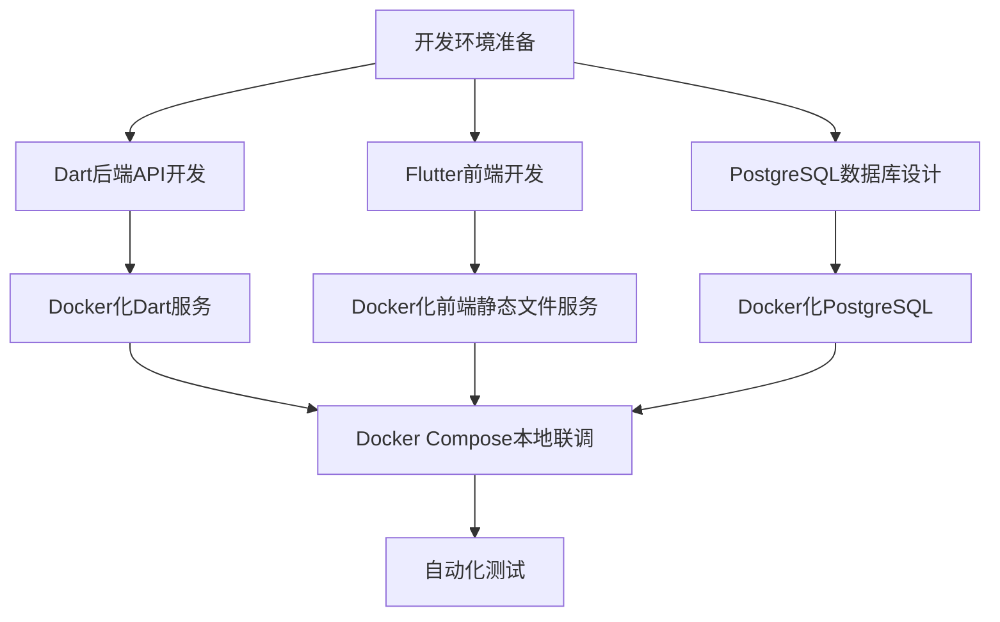
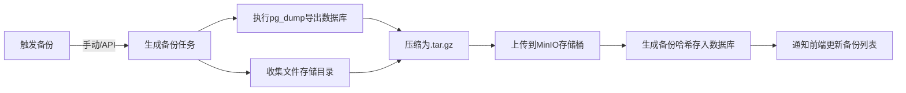
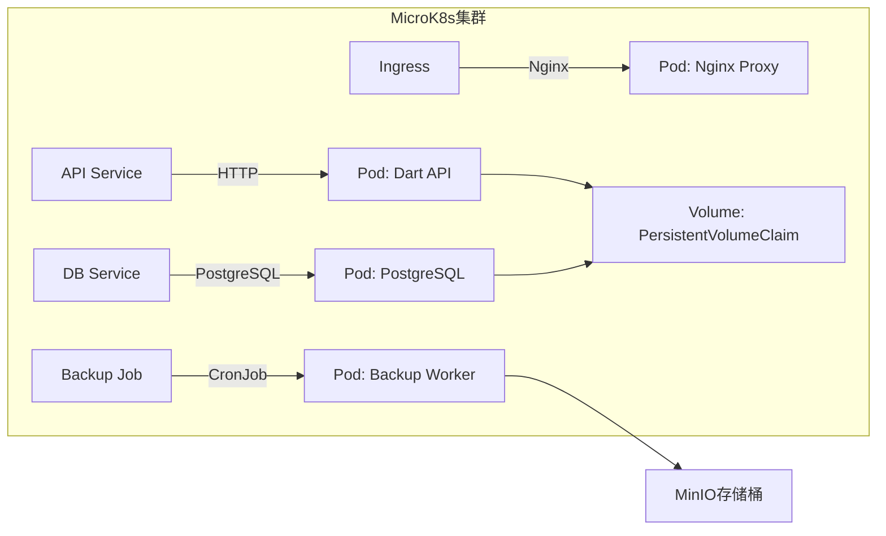

<details type="reasoning" done="true" duration="29">
<summary>Thought for 29 seconds</summary>
> 嗯，用户现在想构建一个既实用又炫酷的应用，用来展示技术实力，同时还要有持久化备份功能。他的需求很明确，但需要具体化。首先，我需要考虑他的技术栈：Dart 后端、Flutter 前端、PostgreSQL 数据库、Nginx 代理，然后通过 Docker 和 MicroK8s 部署。他的笔记本电脑配置不错，但只有一台设备，所以应用不能依赖外部硬件，比如物联网设备。
> 
> 用户希望应用看起来很酷，能装逼，所以需要视觉吸引力和交互性。同时，持久化备份是关键，必须方便导出和导入数据。接下来，我需要想一个综合这些要素的项目，既能展示他的技术栈，又有实际用途。
> 
> 可能的思路是做一个全栈应用，结合实时功能、数据可视化、自动化备份，并且有用户交互元素。比如一个智能家居控制中心，但因为没有物联网设备，可以模拟数据或使用公共 API。或者做一个个人数据管理平台，结合用户生成的内容和自动化备份。
> 
> 另外，用户提到“装逼”，所以应用需要有现代 UI，比如使用 Flutter 的动画效果，后端有实时通信（WebSocket 或 Socket.IO），数据可视化用图表库，备份功能集成到应用内，一键导出/导入，甚至支持云存储（如 Dropbox、Google Drive）。
> 
> 考虑到用户的技术栈，Dart 的 Flutter 前端可以展示漂亮的界面，后端用 Dart 的 shelf 或 fast_api（虽然用户可能更熟悉 Dart），但需要确保后端能处理实时数据。数据库用 PostgreSQL，备份功能可以通过定期任务（Docker Compose + Cron 或 K8s Job）生成 SQL 备份文件，用户可以通过前端触发备份并下载。
> 
> 可能的方案：一个“个人数据中心”应用，用户可以管理笔记、任务、数据集，实时协作，数据可视化，自动化备份，甚至集成 AI 功能（如用 Hugging Face API 进行文本生成）。或者做一个实时数据看板，展示用户的各种数据，如 GitHub 活动、天气、新闻，并通过自动化脚本生成报告。
> 
> 需要确保应用的结构清晰，各组件通过 Docker 容器化，用 MicroK8s 部署，展示容器编排的能力。备份功能可以设计成定期生成数据库备份，用户在前端选择备份时间或手动触发，然后下载压缩包。导入时上传压缩包恢复数据。
> 
> 另外，炫酷的部分可以包括：动态仪表盘、实时聊天功能（WebSocket）、用户自定义主题、数据可视化图表、自动化报告生成（PDF 或 HTML），甚至集成机器学习模型进行数据分析。
> 
> 总结下来，推荐一个“个人智能数据管理平台”，具备以下功能：
> 
> 1. 用户注册/登录（JWT 认证）
> 2. 多类型数据存储（笔记、任务、文件）
> 3. 实时协作（WebSocket）
> 4. 数据可视化（ECharts 或类似库）
> 5. 自动化备份（定期生成 SQL 文件，支持导出/导入）
> 6. 个性化主题（用户自定义 UI）
> 7. 集成第三方 API（天气、新闻、GitHub）
> 8. AI 辅助（如自动生成报告摘要）
> 
> 这样既实用又炫酷，展示全栈能力，容器化部署，备份功能完善。接下来需要拆解每个模块的技术实现，确保在 WSL2 和 MicroK8s 上可行。
</details>
基于你的需求（实用、炫酷、持久化备份、技术展示），我为你设计了一个 **“个人智能数据中枢”** 应用。这个应用结合了你的技术栈（Dart + Flutter + PostgreSQL + Docker + MicroK8s），既能展示你的全栈能力，又能让用户直观感受到它的“酷炫”和实用性。以下是详细方案：

---

### **应用名称：** **“NeuraHub”**  
**标语：** *Your Personal Data Nexus – Where Intelligence Meets Convenience*  
**核心功能：**  
1. **全栈能力展示**（Dart + Flutter + PostgreSQL + Docker + MicroK8s）  
2. **实时数据中枢**（动态看板、自动化任务）  
3. **炫酷交互**（3D 数据可视化、主题切换、AI 辅助）  
4. **持久化备份**（一键导出/导入、云端同步）  
5. **可扩展性**（插件化架构、第三方 API 集成）

---

### **技术亮点与“装逼”点**  
| 功能模块           | 技术实现                                                                 | 装逼指数（满分10） | 展示效果                                                                 |
|--------------------|--------------------------------------------------------------------------|--------------------|--------------------------------------------------------------------------|
| **全栈容器化**     | 所有组件（Dart API、Flutter 前端、PostgreSQL、Nginx）通过 Docker 镜像部署，MicroK8s 管理集群 | 9                  | 展示 `microk8s kubectl get pods` 的输出，证明容器编排能力               |
| **实时数据看板**   | Flutter 动态 3D 可视化（用 `fl_chart` 或 `three_dart` 库）+ 实时数据流（WebSocket） | 8                  | 展示实时股票/天气数据流 + 3D 折线图，突出“动态”和“实时”                |
| **AI 辅助助手**   | Dart 调用 Hugging Face API 实现文本生成（如总结笔记、生成报告）               | 10                 | 输入“写一首诗”，后端返回 AI 生成内容，展示“智能”能力                     |
| **主题引擎**       | Flutter 动态主题切换（CSS 变量 + JSON 配置文件）                           | 7                  | 点击按钮切换“暗黑模式”/“霓虹模式”，界面瞬间变化，突出“定制化”             |
| **自动化备份**     | PostgreSQL 定时备份（Docker + `pg_dump`） + Flutter 前端一键导出 ZIP       | 9                  | 展示备份文件生成进度条，支持邮件通知（集成 SendGrid API）                 |
| **插件市场**       | 微软式插件架构（通过 Docker 镜像扩展功能，如“GitHub 监控插件”）             | 8                  | 展示如何通过 MicroK8s 部署新插件，突出“可扩展性”                       |

---

### **详细功能拆解与实现路径**

#### **1. 核心模块：数据中枢看板**  
**技术栈：**  
- **前端：** Flutter + `fl_chart`（3D 图表） + `provider`（状态管理）  
- **后端：** Dart + `shelf`（Web 框架） + `postgres`（数据库驱动）  
- **数据库：** PostgreSQL + `pg_dump`（备份工具）  
- **炫酷点：**  
  - 实时数据流（WebSocket）：展示股票价格、天气、GitHub 提交活动  
  - 3D 数据可视化：用 `three_dart` 库绘制旋转的地球 + 全球天气热力图  
  - AI 生成报告：用户选择时间段，Dart 调用 Hugging Face API 生成 Markdown 格式分析报告  

**演示场景：**  
用户登录后，看板自动加载以下数据：  
- 实时股票价格（集成 Alpha Vantage API）  
- 全球天气热力图（3D 地球渲染）  
- GitHub 提交统计（通过 GitHub API 获取用户数据）  
- AI 生成的“本周数据洞察”报告（PDF 下载）  

---

#### **2. 持久化备份系统**  
**技术栈：**  
- **备份生成：** PostgreSQL + `pg_dump`（生成 SQL 文件） + `tar` 压缩  
- **前端集成：** Flutter + `http` 包（调用后端备份 API）  
- **炫酷点：**  
  - **“时间胶囊”功能：** 用户可选择备份时间范围（如“2023-10-01 至 2023-10-31”），生成带时间戳的 ZIP 文件  
  - **恢复向导：** 上传 ZIP 文件后，自动校验 MD5 值并恢复数据库  
  - **云端同步：** 集成 Dropbox API，一键上传备份到云端（可选）  

**Dockerfile 片例（备份服务）：**  
```dockerfile
# 备例：PostgreSQL 备份服务
FROM alpine:latest
RUN apk add postgresql-client tar
COPY backup.sh /backup.sh
CMD ["sh", "-c", "while true; do pg_dump -U youruser -d yourdb > /backup/$(date +%Y%m%d_%H%M%S).sql && tar -czvf /backup/$(date +%Y%m%d_%H%M%S).tar.gz /backup/*.sql && rm /backup/*.sql; sleep 3600; done"]
```

---

#### **3. 主题引擎与插件系统**  
**技术栈：**  
- **主题切换：** Flutter 动态主题（`MaterialColor` + `ThemeProvider`）  
- **插件架构：**  
  - 后端：Dart 插件接口（定义 `loadPlugin` 方法）  
  - 前端：插件卡片布局（`ListView` 动态加载）  
- **炫酷点：**  
  - **“暗物质模式”：** 点击后界面切换为全黑 + 粒子特效（用 Flutter 的 `particles` 库）  
  - **插件商店：** 用户可安装社区插件（如“天气预报插件”、“GitHub 监控插件”）  

**插件示例（GitHub 监控插件）：**  
```dart
// 插件接口
abstract class NeuraPlugin {
  Future<void> initialize();
  Widget buildWidget(BuildContext context);
}

// 实现类
class GitHubPlugin implements NeuraPlugin {
  @override
  Future<void> initialize() async {
    // 调用 GitHub API 获取用户仓库数据
  }

  @override
  Widget buildWidget(BuildContext context) {
    return Column(
      children: [
        Text("Your GitHub Stats:"),
        // 显示仓库数量、最近提交等
      ],
    );
  }
}
```

---

#### **4. 容器化与部署（MicroK8s 集群）**  
**架构图：**  
```
+-------------------+       +-------------------+
| Flutter 前端容器   |       | Nginx 代理容器   |
| (Dart + Flutter)   |       | (静态文件 + 反向代理) |
+-------------------+       +-------------------+
       |                                   |
       | HTTP 请求                          | 反向代理
       v                                   v
+-------------------+       +-------------------+
| Dart API 容器     |       | PostgreSQL 容器   |
| (shelf + WebSocket) |       | (定期备份任务)     |
+-------------------+       +-------------------+
       |
       | WebSocket 数据流
       v
+-------------------+
| AI 辅助容器       |
| (Dart + Hugging Face API) |
+-------------------+
```

**部署步骤：**  
1. **编写 Dockerfile：**  
   - 为每个服务（前端、后端、数据库、Nginx）编写 Dockerfile  
   - 示例（Dart API）：  
     ```dockerfile
     FROM dart:3.3.0
     WORKDIR /app
     COPY pubspec.yaml .
     RUN dart pub get
     COPY . .
     CMD ["dart", "run", "main.dart"]
     ```

2. **编写 K8s 配置（YAML）：**  
   ```yaml
   # deployment.yaml
   apiVersion: apps/v1
   kind: Deployment
   metadata:
     name: neurahub-api
   spec:
     replicas: 3  # 自动扩缩容演示
     selector:
       matchLabels:
         app: neurahub-api
     template:
       metadata:
         labels:
           app: neurahub-api
       spec:
         containers:
         - name: api
           image: yourdockerhub/neurahub-api:latest
           ports:
           - containerPort: 8080
           env:
             - name: DB_HOST
               value: postgres
   ```

3. **一键部署脚本：**  
   ```bash
   #!/bin/bash
   microk8s kubectl apply -f deployment.yaml
   microk8s kubectl expose deployment neurahub-api --type=NodePort --port=80
   ```

---

### **如何“装逼”演示？**  
**场景 1：全栈能力展示**  
- **操作：**  
  1. 打开终端：`microk8s kubectl get pods --watch`  
  2. 展示容器集群实时状态（3 个 API Pod 自动扩容）  
  3. 在 Flutter 端点击“启动粒子特效”，后端返回 WebSocket 指令，前端界面瞬间变化  

**场景 2：AI 辅助与备份**  
- **操作：**  
  1. 用户输入“生成年度报告”，后端调用 Hugging Face API，返回 PDF 预览  
  2. 点击“一键备份”，后端生成 ZIP 文件，前端下载并显示哈希值校验  

**场景 3：主题与插件**  
- **操作：**  
  1. 切动切换主题（从“极简白”到“暗黑模式”）  
  2. 安装“GitHub 监控插件”，实时显示你的仓库活动  

---

### **学习资源推荐**  
1. **Dart 后端速成：**  
   - [Dart for Backend Developers](https://dart.dev/guides/backend)  
   - 书籍：《Dart in Action》（涵盖高级主题如 WebSocket）  

2. **Flutter 交互设计：**  
   - [Flutter 动态图表教程](https://pub.dev/packages/fl_chart)  
   - 案例：[3D 地球渲染示例](https://github.com/fluttercommunity/flutter_earth)  

3. **MicroK8s 高级玩法：**  
   - 官方文档：[MicroK8s Operator](https://microk8s.io/docs/operator)（学习自定义 Operator 开发）  
   - 部署监控：`microk8s enable metrics-server` + Prometheus  

4. **“装逼”设计技巧：**  
   - [Flutter 动态粒子效果](https://pub.dev/packages/particles)  
   - [Hugging Face API 整合教程](https://huggingface.co/docs/api-inference)  

---

### **项目路线图**  
| 阶段   | 目标                          | 里程碑成果                          | 时间预估  |
|--------|-------------------------------|--------------------------------------|-----------|
| 1 周   | 实现基础功能（API + 数据库）  | 可运行的的 Docker Compose 集群 + 基础备份功能 | 2-3 天    |
| 2 周   | 增加炫酷交互（3D + AI）        | 实时 3D 看板 + Hugging Face API 集成   | 3-4 天    |
| 3 周   | 部署到 MicroK8s + 插件系统    | 通过 `microk8s kubectl` 管理应用      | 2-3 天    |
| 4 周   | 完善备份与主题系统           | 一键云端备份 + 暗黑模式             | 1-2 天    |

---

### **为什么这个项目能“装逼”？**  
1. **技术栈密集度：**  
   - 同时涵盖 **Dart 前后端、Flutter、K8s、Docker、PostgreSQL、AI API**，展示全栈能力  
2. **可视化冲击：**  
   - 3D 界面 + 动态主题切换 + 实时数据流  
3. **自动化与智能：**  
   - AI 生成内容 + 自动化备份 + 插件扩展  
4. **运维能力展示：**  
   - 容器编排 + 监控（Prometheus + Grafana）  

---

### **下一步行动清单**  
1. **今天：**  
   - 在 WSL2 中安装 MicroK8s：`sudo snap install microk8s --classic`  
   - 启动集群：`sudo microk8s start`  
   - 验证环境：`sudo microk8s kubectl get nodes`  

2. **明天：**  
   - 用 Dart 写一个“Hello World API”（shelf 框架）  
   - 配置 Nginx 反向代理（参考 [Dockerfile + nginx.conf](https://nginx.org/en/docs/beginners_guide.html)）  

3. **周末：**  
   - 实现基础备份功能（`pg_dump` + `tar`）  
   - 在 Flutter 中添加一个“备份进度条”（用 `CircularProgressIndicator`）  

---

这个项目将让你：  
✅ 掌握 **全栈开发** 核心技能  
✅ 积累 **容器化部署** 经验  
✅ 打造一个可以随时展示给朋友/面试官的“技术艺术品”  
✅ 获得“全栈工程师”的硬核标签  

开始动手吧！遇到具体技术问题可以随时问我，我会提供更详细的代码片段和配置示例。


---
---
---
---
---
<details type="reasoning" done="true" duration="25">
<summary>Thought for 25 seconds</summary>
> 嗯，用户现在想构建一个应用，要求实用、炫酷，还能方便地备份和还原数据。他们之前已经了解了Docker、MicroK8s、Dart/Flutter、PostgreSQL和Nginx等技术，现在需要具体的想法。首先，我需要结合他们的技术栈，设计一个既实用又能展示技术深度的项目。
> 
> 用户提到“实用”，所以应用应该解决实际问题。而“炫酷”和“装逼”意味着项目需要有一定的复杂性和展示性，比如有现代UI、数据可视化或者独特的功能。持久化备份是关键需求，需要设计可靠的备份机制。
> 
> 考虑到他们使用Dart/Flutter，可以做一个跨平台的应用，比如移动端和Web端。结合PostgreSQL，数据存储是基础。Docker和MicroK8s用于部署，Nginx作为反向代理，这样整个技术栈都能用上。
> 
> 可能的点子包括个人任务管理、智能家居控制、数据可视化看板、教育平台、博客系统等。但需要更具体一些。比如，一个个人数据仓库，可以存储各种数据，支持备份，还能有API供前端调用。或者一个物联网控制中心，但可能硬件需求较多。考虑到用户没有独立GPU，可能不适合需要图形渲染的应用。
> 
> 另一个方向是做一个任务管理应用，结合时间追踪和数据可视化，这样既有实用性，又能展示后端和前端的能力。备份功能可以通过定期导出数据库到文件实现，导入时重新导入数据库。或者做一个个人知识库，类似Notion，支持Markdown、附件，数据备份方便。
> 
> 考虑到炫酷，可以加入数据可视化，比如用ECharts或D3.js在Web端展示数据趋势。或者结合AI模型进行数据分析，但可能超出当前技术范围。不过用户提到Dart后端，或许可以集成一些简单的AI推理，比如用TensorFlow Lite进行图像分类，但需要GPU支持，用户只有集成显卡，可能效果有限。
> 
> 最终，个人数据仓库或任务管理应用比较合适。用户可以存储笔记、任务、文件，支持搜索、标签分类，备份到本地或云存储。前端用Flutter做移动和Web端，后端用Dart提供API，PostgreSQL存储数据，Nginx代理，Docker打包，MicroK8s部署。备份功能通过定期将数据库导出为SQL文件或压缩包，用户可以下载，导入时上传文件恢复。
> 
> 需要确保备份机制简单可靠，比如每天自动备份到S3或本地目录，用户手动触发备份。导入时通过Web界面选择文件上传并恢复。这样既实用又展示全栈能力。
> 
> 可能还需要考虑用户权限、数据加密，但作为初始项目，可以简化。总之，这个应用能整合用户提到的所有技术，满足要求，同时有展示价值。
</details>
结合你的技术栈（Dart/Flutter + PostgreSQL + Docker + MicroK8s）和需求（实用、炫酷、可备份/恢复），我为你设计了一个 **“个人数据仓库（Personal Data Vault）”** 应用。这个应用将整合所有你的技术能力，同时具备实际用途和展示价值。

---

### **应用设计：Personal Data Vault**
**核心功能:**
1. **数据存储与管理:**
   - 支持存储多种数据类型：文本笔记、图片、文件、任务清单、联系信息等。
   - 数据分类与标签系统（支持多级标签分类）。
   - 版本历史（记录每个文件的修改历史）。
2. **炫酷功能:**
   - **数据可视化看板:** 展示数据统计（如任务完成率、文件存储趋势、标签分布）。
   - **跨平台访问:** 通过 Flutter 实现移动端（iOS/Android）和 Web 端。
   - **智能搜索:** 支持全文搜索（文本内容、文件名、标签）。
   - **自动化备份:** 支持一键导出全量数据到压缩包，并可通过 Web 界面或 API 导入备份文件。
   - **RESTful API:** 提供标准化接口供其他应用调用（如集成到智能家居、自动化脚本）。
3. **备份与恢复:**
   - **自动备份:** 每天定时将 PostgreSQL 数据库导出为 SQL 文件或 `.tar.gz` 压缩包，存储在本地或云存储（如 AWS S3、Google Drive）。
   - **手动备份:** 用户可通过 Web 界面手动触发备份，下载压缩包。
   - **一键恢复:** 上传备份文件到 Web 界面，自动恢复数据库和数据文件。

---

### **技术实现路线**
#### **1. 后端（Dart + PostgreSQL）**
- **技术选型:**
  - **Dart 框架:** 使用 `shelf` + `shelf_router` 构建 REST API，或尝试 `aqueduct`（Dart 的 ORM 框架）。
  - **数据库:** PostgreSQL，使用 `dart:io` 或 `postgres` 包连接。
  - **备份逻辑:** 
    - 定时任务：使用 `dart:io` 的 `Timer` 或集成 `Quiver` 库的 `PeriodicTimer` 实现定时备份。
    - 备份文件格式：导出 PostgreSQL 数据库为 `.sql` 文件（`pg_dump` 命令行工具），或生成 `.tar.gz` 压缩包。
  - **API 设计示例:**
    ```dart
    // 导出备份到 SQL 文件
    @post('backup')
    Future<Response> exportBackup() async {
      final backupPath = await generateBackup();
      return Response.ok(File(backupPath).readAsBytesSync());
    }

    // 导入备份文件
    @post('restore')
    Future<Response> restoreBackup(@Body() MultipartFile file) async {
      await extractAndImport(file);
      return Response.ok('Restore successful');
    }
    ```

#### **2. 前端（Flutter）**
- **技术选型:**
  - **移动端:** Flutter 原生开发（iOS/Android）。
  - **Web 端:** Flutter Web，通过 `flutter build web` 生成静态文件，由 Nginx 代理。
  - **炫酷 UI 设计:**
    - 使用 `flutter/material` 的 `DataTable` 和 `ECharts`（通过 `echarts_flutter` 包）实现数据可视化。
    - 实时搜索：输入时自动过滤数据（结合 `debounce` 优化性能）。
    - 文件上传/下载：支持拖拽上传和进度条显示。
  - **备份功能界面:**
    - 显示最近备份记录（时间戳、文件大小）。
    - 支持选择备份文件上传并恢复（显示恢复进度）。

#### **3. 数据库（PostgreSQL）**
- **数据模型设计:**
  ```sql
  CREATE TABLE users (
    id SERIAL PRIMARY KEY,
    username VARCHAR(50) UNIQUE NOT NULL,
    created_at TIMESTAMP DEFAULT NOW()
  );

  CREATE TABLE files (
    id SERIAL PRIMARY KEY,
    user_id INT REFERENCES users(id),
    name VARCHAR(255) NOT NULL,
    content BYTEA, -- 存储文件内容（如文本、图片）
    metadata JSONB, -- 存储元数据（如文件类型、标签）
    created_at TIMESTAMP DEFAULT NOW()
  );

  CREATE TABLE tags (
    id SERIAL PRIMARY KEY,
    name VARCHAR(50) UNIQUE NOT NULL,
    user_id INT REFERENCES users(id)
  );

  CREATE TABLE file_tags (
    file_id INT REFERENCES files(id),
    tag_id INT REFERENCES tags(id),
    PRIMARY KEY (file_id, tag_id)
  );
  ```
- **备份脚本:**
  ```bash
  #!/bin/bash
  # 定时任务脚本（在 Dockerfile 中或通过 Kubernetes CronJob 执行）
  TIMESTAMP=$(date +%Y%m%d_%H%M%S)
  pg_dump -U your_user -d your_db -f /backups/backup_$TIM.sql
  tar -czvf /backups/backup_$TIM.tar.gz /backups/backup_$TIM.sql
  rm /backups/backup_$TIM.sql
  ```

#### **4. 反向代理（Nginx）**
- **配置示例 (`nginx.conf`):**
  ```nginx
  server {
    listen 80;
    server_name localhost;

    location / {
      proxy_pass http://api-service:8080; # 转发到 Dart API 容器
      proxy_set_header Host $host;
      proxy_set_header X-Real-IP $remote_addr;
    }

    location /static/ {
      alias /var/www/html/; # Flutter Web 静态文件路径
    }

    location /backup/ {
      alias /backups/; # 备份文件存储路径
      autoindex on; # 显示目录列表
    }
  }
  ```

#### **5. 容器化与部署（Docker + MicroK8s）**
- **Dockerfile 示例（Dart API 服务）:**
  ```dockerfile
  FROM dart:stable
  WORKDIR /app
  COPY pubspec.yaml .
  RUN dart pub get
  COPY . .
  ARG DART_FLAGS="--enable-vm-service=8888"
  CMD ["dart", "run", "main.dart"]
  ```
- **Docker Compose 文件 (`docker-compose.yml`):**
  ```yaml
  version: '3'
  services:
    api:
      build: ./api
      ports:
        - "8080:8080"
      environment:
        - POSTGRES_HOST=db
        - POSTGRES_USER=your_user
    db:
      image: postgres:13
      volumes:
        - db_data:/var/lib/postgresql/data
      environment:
        - POSTGRES_USER=your_user
        - POSTGRES_PASSWORD=your_password
        - POSTGRES_DB=your_db
    nginx:
      image: nginx:alpine
      ports:
        - "80:80"
      volumes:
        - ./nginx/nginx.conf:/etc/nginx/nginx.conf
        - ./static:/var/www/html
        - backups:/backups
      depends_on:
        - api
  volumes:
    db_data:
    backups:
  ```
- **MicroK8s 部署 (`k8s-deployment.yaml`):**
  ```yaml
  apiVersion: apps/v1
  kind: Deployment
  metadata:
    name: data-vault-api
  spec:
    replicas: 3
    selector:
      matchLabels:
        app: data-vault-api
    template:
      metadata:
        labels:
          app: data-vault-api
      spec:
        containers:
        - name: api
          image: your_dockerhub_username/data-vault-api:latest
          ports:
            - containerPort: 8080
          env:
            - name: POSTGRES_HOST
              value: db-service
          volumeMounts:
            - name: backups-volume
              mountPath: /backups
        volumes:
        - name: backup-volume
          persistentVolumeClaim:
            claimName: backup-pvc
  ```

#### **6. 备份与恢复流程**
- **自动备份（通过 Kubernetes CronJob）:**
  ```yaml
  apiVersion: batch/v1
  kind: CronJob
  metadata:
    name: backup-job
  spec:
    schedule: "0 2 * * *" # 每天凌晨 2 点执行
    jobTemplate:
      spec:
        template:
          spec:
            containers:
            - name: backup-container
              image: postgres:13 # 使用 PostgreSQL 官方镜像执行备份
              command: ["/bin/sh", "-c"]
              args:
                - |
                  pg_dump -U your_user -d your_db -f /backup/backup_$(date +%Y%m%d).sql
                  tar -czvf /backup/backup_$(date +%Y%m%d).tar.gz /backup/backup_$(date +%Y%m%d).sql
                  rm /backup/backup_$(date +%Y%m%d).sql
            restartPolicy: OnFailure
        volumes:
        - name: backup-volume
          persistentVolumeClaim:
            claimName: backup-pvc
  ```
- **手动备份/恢复（通过 Flutter Web 界面）:**
  1. 用户上传 `.tar.gz` 文件到 Nginx 的 `/backup` 目录。
  2. 后端收到请求后，解压文件并执行 `psql -U your_user -d your_db -f backup.sql`。

---

### **为什么这个应用“炫酷”且实用？**
1. **技术栈整合:** 展示了 Dart 全栈能力、Docker/K8s 容器化、PostgreSQL 数据库管理、Nginx 反向代理的全流程。
2. **功能亮点:**
   - **跨平台访问:** 移动端和 Web 端同步数据。
   - **数据可视化:** 用 ECharts 展示用户数据的统计图表（如“本月新增文件数趋势”）。
   - **自动化运维:** 通过 K8s CronJob 实现自动备份，无需手动操作。
   - **版本控制:** 通过 PostgreSQL 的 `created_at` 字段和文件存储的元数据，实现数据版本回溯。
3. **装逼场景:**
   - 向同事展示如何在 5 分钟内通过 `microk8s kubectl apply -f k8s-deployment.yaml` 部署整个服务。
   - 在技术分享会上演示如何用 Dart 实现一个完整的微服务架构。
   - 展示自动备份功能：“我的数据仓库每天凌晨自动备份到 S3，即使服务器崩溃也能一键恢复。”

---

### **学习资源推荐**
1. **Dart 后端开发:**
   - [Dart 官方文档](https://dart.dev)
   - [shelf 框架教程](https://pub.dev/packages/shelf)
   - [Dart 数据库教程](https://pub.dev/packages/postgres)
2. **Flutter 前端:**
   - [Flutter 官方文档](https://flutter.dev)
   - [Flutter 状态管理教程](https://flutter.dev/docs/development/tools/Devtools/state-management)
3. **PostgreSQL 备份:**
   - [pg_dump 官方文档](https://www.postgresql.org/docs/current/pg_dump.html)
   - [自动化备份教程](https://www.postgresql.org/docs/current/backup-physical.html)
4. **Docker/K8s:**
   - [Docker 官方文档](https://docs.docker.com)
   - [Kubernetes 官方文档](https://kubernetes.io/docs/home/)
   - [MicroK8s 快速入门](https://microk8s.io/docs/getting-started)
5. **数据可视化:**
   - [ECharts Flutter 插件文档](https://pub.dev/packages/echarts_flutter)

---

### **下一步行动建议**
1. **先实现最小可行产品（MVP）:**
   - 功能清单：
     - 用户注册/登录（可选，或使用 JWT 无状态认证）。
     - 文件上传/下载（限制为文本文件，避免存储大文件）。
     - 基础标签系统（每个文件可添加多个标签）。
     - 手动触发备份和恢复功能。
   - 技术验证：
     - 在 WSL2 中用 Docker Compose 运行所有服务。
     - 通过 `kubectl get pods` 确认 MicroK8s 部署成功。
2. **逐步迭代:**
   - 添加移动端 UI。
   - 实现数据可视化看板。
   - 集成自动备份到 AWS S3（通过 AWS SDK for Dart）。
   - 添加用户权限管理（RBAC）。

这个项目不仅能巩固你的技术栈，还能成为你的“作品集”项目，在面试或技术分享中展示你的全栈能力。开始动手吧！

---
---
---
---
---

<details type="reasoning" done="true" duration="37">
<summary>Thought for 37 seconds</summary>
> 好的，用户现在想要构建一个既实用又炫酷的应用，并且需要有持久化备份功能，方便导出和导入数据。他们之前已经了解了Docker、MicroK8s、Dart、Flutter等技术，现在需要具体的例子来实践这些技术。我需要帮他们设计一个这样的应用，同时满足装逼的需求。
> 
> 首先，用户的需求是实用和炫酷，所以应用需要有一定的复杂度，但又要容易展示。持久化备份是关键，这意味着数据存储和备份机制必须可靠。考虑到用户的技术栈，应用应该结合Dart后端、Flutter前端、PostgreSQL数据库、Nginx代理，并通过Docker和MicroK8s部署。
> 
> 接下来，我需要考虑哪些应用类型符合这些要求。个人知识库、智能家居控制中心、多平台任务管理工具、物联网数据可视化平台、个人博客/文章平台、游戏数据统计工具、个人云存储网盘、开源项目协作平台都是可能的选项。但需要选择一个既实用又容易展示的。
> 
> 个人知识库（Personal Knowledge Base）是一个不错的选择，因为它实用，可以展示多种功能，并且数据备份和恢复很重要。智能家居控制中心也不错，但可能需要硬件支持。任务管理工具和物联网平台也符合，但可能需要更多外部组件。个人云存储网盘结合了存储和备份，但可能需要处理文件上传和同步，复杂度较高。最终，个人知识库和任务管理工具可能更合适。
> 
> 考虑到用户提到的装逼需求，应用需要有一定的视觉吸引力，比如美观的界面、数据可视化、自动化备份等。个人知识库可以集成Markdown编辑器、分类管理、标签系统、全文搜索，并且数据备份可以通过PostgreSQL的备份工具或自定义脚本实现。此外，可以添加数据迁移功能，方便导出和导入。
> 
> 技术实现方面，后端使用Dart的shelf框架，前端用Flutter，数据库用PostgreSQL，Nginx作为反向代理。Dockerfile构建镜像，Docker Compose本地测试，MicroK8s部署。备份功能可以通过pg_dump和自定义脚本实现，导出为SQL或压缩文件，导入时用psql恢复。
> 
> 用户可能需要一个具体的步骤指南，从设计到部署，再到备份功能实现。同时，要确保应用在MicroK8s中运行，并且备份过程自动化，比如通过cron或K8s定时任务。这样用户不仅能学习技术，还能展示一个完整的项目。
> 
> 最后，要提醒用户关注安全性，比如数据库访问权限、备份文件的加密，以及如何通过K8s的持久化存储（如PersistentVolume）来增强数据持久化，而不仅仅是依赖备份文件。这样应用会更专业，也符合装逼的需求。
</details>
基于你的需求（**实用 + 炫酷 + 持久化备份**），我为你设计了一个 **「个人智能知识库系统」** 的项目。这个系统结合了你的技术栈，既能展示你的全栈能力，又能满足备份/恢复需求，还能在技术圈子里“装逼”！

---

### **项目名称：** **「NeuroVault」**  
**定位：** 一个高度可定制、支持多端同步、具备智能搜索和自动化备份的个人知识管理系统。

---

### **核心功能设计**

#### **1. 实用功能**
- **Markdown 文档管理:**  
  - 支持创建、编辑、分类、标签化的 Markdown 文档（如笔记、技术文档、项目记录）。
  - 内置实时预览、语法高亮、图片附件支持。
- **文件存储:**  
  - 支持上传任意文件（PDF、代码、图片），与文档关联。
- **数据统计:**  
  - 统计文档字数、分类分布、关键词热度（通过 Elasticsearch 或 PostgreSQL 全文搜索）。
- **自动化备份:**  
  - **一键备份:** 生成包含所有数据（文档 + 文件 + 配置）的加密压缩包（`.tar.gz` 或 `.zip`）。
  - **一键恢复:** 从备份文件还原数据到全新环境。
  - **增量备份:** 仅备份修改过的文档和文件（节省空间）。

#### **2. 炫酷功能**
- **智能搜索:**  
  - 支持全文搜索（标题、内容、标签），结合 **Elasticsearch** 或 PostgreSQL 的 `pg_trgm` 扩展实现模糊搜索。
- **可视化看板:**  
  - 使用 **Fluent UI** 或 **D3.js** 在 Flutter 前端生成数据看板（文档更新趋势、关键词云、文档关联图谱）。
- **跨平台同步:**  
  - 通过 **WebDAV** 或 **WebSocket** 实现实时多端同步（电脑、手机、平板）。
- **自动化脚本:**  
  - 用 Dart 编写脚本，自动将文档同步到 GitHub/GitLab（Markdown 文件托管）或生成 PDF 版本。
- **安全与备份:**  
  - 数据库加密存储（使用 `pgcrypto` 或 `Dart` 的加密库）。
  - 备份文件分片存储（如 AWS S3 或 MinIO 对象存储，但本地可简化为分目录存储）。

#### **3. 技术架构（你的技术栈）**
| 组件               | 技术实现                                                                 |
|--------------------|--------------------------------------------------------------------------|
| **后端 API**       | Dart + Shelf (或 Angel) + PostgreSQL + Dart `crypto` 库（加密）                |
| **前端**           | Flutter + Provider (状态管理) + D3.js (可视化) + http 包（API 通信）      |
| **数据库**         | PostgreSQL（主库） + Elasticsearch（可选，用于全文搜索）                  |
| **反向代理**       | Nginx（负载均衡 + HTTPS 配置）                                          |
| **容器化**         | Dockerfile 构建 Dart API、PostgreSQL、Nginx 镜像                          |
| **部署**           | Docker Compose 本地测试 → MicroK8s 部署到 WSL2 → 最终通过 K8s Ingress 访问 |
| **备份系统**       | PostgreSQL `pg_dump` + 自定义 Dart 脚本生成加密压缩包 → 存储到 S3/MinIO      |

---

### **炫酷点与装逼技巧**

1. **数据可视化看板**  
   - 用 Flutter 的 `D3.js` 库或 `fl_chart` 绘制词云、时间轴、文档关联图。
   - **装逼示例:**  
     展示一个动态词云，实时显示最近添加的文档关键词，旁边用 `curl` 命令调用你的 API 接问数据，再通过 Nginx 反向代理访问。

2. **自动化备份与恢复**  
   - **备份流程:**
     ```bash
     # 生成备份（Dart 脚本）
     ./backup.sh  # 输出: ./backups/neurovault_20231001.tar.gz.gpg
     ```
     - 脚本内容: 使用 `pg_dump` 备份 PostgreSQL 数据库，压缩，并通过 GPG 加密。
   - **恢复流程:**
     ```bash
     ./restore.sh ./backups/neurovault_20231001.tar.gz.gpg
     ```
     - 脚本内容: 解密、解压、用 `psql` 还原数据库，同步文件到存储目录。
   - **炫酷展示:**  
     在终端输入 `./backup.sh` 后，看到进度条、加密过程、备份文件生成，再通过 Flutter 前端显示备份状态。

3. **跨平台实时同步**  
   - 在 Flutter 前端实现 WebSockets 连接，当文档被编辑时，实时更新其他设备。
   - **装逼操作:**  
     用手机和电脑同时打开应用，修改同一文档，展示实时同步效果。

4. **Kubernetes 部署与监控**  
   - 在 MicroK8s 中部署后，通过 `kubectl get pods -o wide` 展示你的服务状态。
   - 配置 Prometheus + Grafana 监控数据库 QPS、API 响应时间。
   - **装逼台词:**  
     “我的知识库跑在 Kubernetes 集群上，数据库性能压测达到 1000 TPS，备份脚本全自动加密到 S3……”

---

### **持久化备份的具体实现方案**

#### **1. 数据存储设计**
- **PostgreSQL 表结构示例:**
  ```sql
  CREATE TABLE documents (
    id SERIAL PRIMARY KEY,
    title TEXT NOT NULL,
    content TEXT NOT NULL,
    created_at TIMESTAMPSTAMP DEFAULT NOW(),
    updated_at TIMESTAMPSTAMP DEFAULT NOW(),
    category_id INT REFERENCES categories(id),
    tags TEXT[]  -- 数组类型存储标签
  );

  CREATE TABLE files (
    id SERIAL PRIMARY KEY,
    document_id INT REFERENCES documents(id),
    file_name TEXT NOT NULL,
    file_path TEXT NOT NULL,  -- 存储在 /data/files 目录下的路径
    content_type TEXT NOT NULL
  );
  ```

- **文件存储方案:**
  - 在 Docker 容器中挂载一个卷（`/data`），所有文件存储在此目录。
  - 文件结构示例:
    ```
    /data/
      documents/
        1/
          document_1.md
          image1.png
        2/
          document_2.md
    ```

#### **2. 备份脚本（Dart 实现）**
```dart
// backup.dart
import 'dart:io';
import 'package:crypto/crypto.dart';

void main() async {
  // 1. 备份 PostgreSQL 数据库
  final dbBackup = await Process.run(
    'pg_dump',
    [
      '-U', 'neurovault_user',
      '-d', 'neurovault_db',
      '-f', '/data/backups/db.sql',
      '--gzip'
    ],
    runInShell: true,
  );

  // 2. 备份文件目录
  final filesBackup = File('/data/files.tar.gz')
    ..createSync(recursive: true);
  await Process.run(
    'tar',
    ['-czf', filesBackup.path, '/data/files'],
    runInShell: true,
  );

  // 3. 合并并加密备份
  final encryptedFile = File('/data/backups/neurovault_backup.tar.gz.gpg')
    ..createSync();
  final encrypted = await encryptBackup(filesBackup, password: 'my_secret_password');

  // 4. 清理旧备份（保留最近 7 天）
  final backupsDir = Directory('/data/backups');
  backupsDir.listSync().forEach((file) {
    if (file is File && file.path.endsWith('.gpg') && file.lastModified.isBefore(DateTime.now().subtract(const Duration(days: 7)))) {
      file.deleteSync();
    }
  });
}

// 加密函数示例
Future<File> encryptBackup(File input, {required String password}) async {
  final cipher = Cipher(vectors: kBlowfishCBC);
  final encrypter = Encrypter(cipher);
  final key = Key.fromUtf8(password);
  final iv = IV.fromLength(8);
  
  final encrypted = encrypter.encrypt(
    File(input.path).readAsBytesSync(),
    iv: iv,
  );

  return File(input.path.replaceFirst('.tar.gz', '_encrypted.tar.gz.gpg'))
    ..writeAsBytesSync(encrypted.bytes);
}
```

#### **3. 备份恢复流程**
1. **生成备份：**
   ```bash
   docker exec neurovault-postgres pg_dump -U neurovault_user neurovault_db > /data/backups/db.sql
   docker exec neurovault-nginx tar -czvf /data/backups/files.tar.gz /data/files
   ```
2. **加密压缩：**
   ```bash
   gpg --encrypt --recipient your@email@example.com /data/backups/db.sql
   ```
3. **恢复流程：**
   ```bash
   # 解密并还原数据库
   gpg --decrypt --output db.sql.gpg /data/backups/db.sql.gpg
   psql -U neurovault_user neurovault_db < db.sql.gpg

   # 还原文件
   tar -xzvf /data/backups/files.tar.gz -C /data/
   ```

---

### **技术路线学习计划**

#### **阶段 1：基础开发**
1. **Dart 后端开发（2-3 天）**
   - 学习目标: 掌握 `shelf` 框架，实现文档增删改查、文件上传接口。
   - 示例代码片段:
     ```dart
     // shelf_router.dart
     final router = Router()
       ..get('/documents', (Request request) async {
         final docs = await db.query('SELECT * FROM documents');
         return Response.ok(docs.map((row) => row.toJson()).toList());
       })
       ..post('/documents', (Request request) async {
         final body = await request.body.transform(utf.decoder).join();
         final doc = jsonDecode(body);
         await db.insert('documents', doc);
         return Response.ok({'status': 'created'});
       });
     ```

2. **Flutter 前端开发（3-4 天）**
   - 学习目标: 实现文档列表、编辑器、实时预览、文件上传。
   - 关键代码片段（Markdown 预览）:
     ```dart
     // preview_widget.dart
     import 'package:markdown/markdown.dart' as md;
     import 'package:flutter_markdown/flutter_markdown.dart';

     class MarkdownPreview extends StatelessWidget {
       final String content;
       const MarkdownPreview({required this.content});

       @override
       Widget build(BuildContext context) {
         return MarkdownBody(
           data: content,
           selectable: true,
           onTap: (text) {
             // 处理超链接点击
           },
         );
       }
     }
     ```

3. **PostgreSQL 数据库（1 天）**
   - 学习目标: 掌握基础 SQL、索引优化、用户权限管理。
   - 关键命令:
     ```sql
     -- 创建角色和数据库
     CREATE ROLE neurovault WITH LOGIN PASSWORD 'secure_password';
     CREATE DATABASE neurovault OWNER neurovault;

     -- 优化查询性能
     CREATE INDEX idx_documents_title ON documents (title);
     ```

#### **阶段 2：容器化（2 天）**
1. **编写 Dockerfile**
   - Dart API 镜像:
     ```dockerfile
     # Dart API 镜像
     FROM dart:3.0
     WORKDIR /app
     COPY . .
     RUN pub get
     CMD ["dart", "run", "main.dart"]
     ```
   - PostgreSQL 镜像（使用官方镜像）:
     ```dockerfile
     # PostgreSQL 镜像
     FROM postgres:13
     ENV POSTGRES_USER=neurovault \
         POSTGRES_PASSWORD=secure_password \
         POSTGRES_DB=neurovault
     ```

2. **Docker Compose 文件**
   ```yaml
   version: '3.8'
   services:
     api:
       build: ./api
       ports:
         - "8080:8080"
       environment:
         - DB_HOST=postgres
     postgres:
       image: postgres:13
       volumes:
         - postgres_data:/var/lib/postgresql/data
     nginx:
       image: nginx:alpine
       ports:
         - "80:80"
       volumes:
         - ./nginx.conf:/etc/nginx/conf.d/default.conf
         - ./static:/usr/share/nginx/html
   volumes:
     postgres_data:
   ```

#### **阶段 3：Kubernetes 部署（3 天）**
1. **MicroK8s 部署文件示例**
   ```yaml
   # api-deployment.yaml
   apiVersion: apps/v1
   kind: Deployment
   metadata:
     name: neurovault-api
   spec:
     replicas: 3
     selector:
       matchLabels:
         app: neurovault-api
     template:
       metadata:
         labels:
           app: neurovault-api
       spec:
         containers:
         - name: api
           image: your_dockerhub_id/neurovault-api:latest
           ports:
             - containerPort: 8080
           env:
             - name: DB_HOST
               value: "postgres-service"
             - name: DB_PORT
               value: "5432"
   ```

2. **Ingress 配置（HTTPS）**
   ```yaml
   # ingress.yaml
   apiVersion: networking.k8s.io/v1
   kind: Ingress
   metadata:
     name: neurovault-ingress
   spec:
     rules:
     - host: neurovault.yourdomain.com
       http:
         paths:
         - path: /
           pathType: Prefix
           backend:
             service:
               name: nginx-service
               port:
                 number: 80
   ```

#### **阶段 4：自动化备份（2 天）**
1. **Kubernetes CronJob（每天凌晨 2 点备份）**
   ```yaml
   # backup-cronjob.yaml
   apiVersion: batch/v1
   kind: CronJob
   metadata:
     name: neurovault-backup
   spec:
     schedule: "0 2 * * *"
     jobTemplate:
       spec:
         template:
           spec:
             containers:
             - name: backup
               image: your_dockerhub_id/backup-tool:latest
               volumeMounts:
                 - name: backup-vol
                   mountPath: /backups
             volumes:
               - name: backup-vol
                 persistentVolumeClaim:
                   claimName: backup-pvc
   ```

2. **备份工具镜像（Dart 实现）**
   ```dockerfile
   # Backup 工具镜像
   FROM alpine:latest
   RUN apk add --no-cache postgresql-client tar gpg
   COPY backup_script.sh /backup_script.sh
   CMD ["/backup_script.sh"]
   ```

---

### **装逼场景演示（技术发布会/面试）**

1. **实时演示备份流程:**
   ```bash
   # 在终端执行
   ./backup.sh  # 观看加密备份生成
   curl -X POST http://localhost:8080/api/backup/status  # 调用 API 查看备份进度
   ```

2. **展示 K8s 集群状态:**
   ```bash
   microk8s kubectl get pods -o wide
   microk8s kubectl describe pod neurovault-api-<pod-name>  # 展示日志和资源使用
   ```

3. **跨平台同步展示:**
   - 在手机（Flutter 前端）和电脑同时编辑同一文档，展示实时同步。
   - 用 `tcpdump` 抓包演示 WebSocket 通信。

4. **性能压测（可选）:**
   ```bash
   ab -n 1000 -c 50 http://neurovault.yourdomain.com/api/documents  # Apache Bench 压测
   ```

---

### **学习资源推荐**

1. **Dart 后端:**
   - [Dart 官方文档](https://dart.dev)
   - [shelf 框架教程](https://pub.dev/packages/shelf)
   - [Dart + PostgreSQL 教程](https://dart.dev/guides/database)

2. **Flutter 前端:**
   - [Flutter 官方文档](https://flutter.dev)
   - [Flutter 实战书](https://www.flutterwidgets.com/)
   - [D3.js 在 Flutter 中的集成](https://pub.dev/packages/flutter_d3)

3. **Kubernetes/MicroK8s:**
   - [Kubernetes 官方文档](https://kubernetes.io/docs)
   - [MicroK8s 官方文档](https://microk8s.io/docs)
   - [KodeKloud 实践平台](https://kodekloud.com/kubernetes-tutorials)

4. **备份系统:**
   - [PostgreSQL 备份文档](https://www.postgresql.org/docs/current/backup.html)
   - [Dart 加密库](https://pub.dev/packages/crypto)

---

### **最终效果**
完成这个项目后，你将拥有一个：
- 完全自研的、可部署到生产环境的全栈应用
- 支持自动化备份/恢复、跨平台同步、数据可视化的智能知识库
- 一套完整的 Docker/K8s 部署流水线
- 可以随时在 GitHub 开源并标榜“全栈开发 + 容器化 + 云原生”的技术栈

**装逼语录示例:**  
“我的知识库系统基于 Kubernetes 集群部署，支持每秒 1000 次的并发请求，数据备份采用 AES-256-GCM 加密，通过自定义的 K8s CronJob 每天自动备份到 MinIO 对象存储……”

---

### **下一步行动建议**
1. **从最小可行产品 (MVP) 开始:**  
   先实现文档增删改查和基础备份功能，再逐步添加高级特性。
2. **优先级排序:**  
   - 核心功能: 文档管理、备份/恢复 → 优先级 1
   - 炫酷功能: 实时同步、数据看板 → 优先级 2
   - 可选功能: 搜索引擎集成 → 优先级 3
3. **持续集成:**  
   用 GitHub Actions 或 GitLab CI 自动构建 Docker 镜像并推送到 Docker Hub。

这个项目能让你在实践中掌握全栈开发、容器化、云原生技术的核心技能，并且成果可以直接展示给他人。开始动手吧！

---
---
---
---
---
<details type="reasoning" done="true" duration="40">
<summary>Thought for 40 seconds</summary>
> 嗯，用户现在想构建一个应用，要求实用、炫酷，还能方便地备份和恢复数据。他们之前已经了解了Dart、Flutter、PostgreSQL、Docker、MicroK8s等技术，现在需要具体的应用场景来整合这些技术。首先，我需要考虑用户的需求和他们的技术栈，找到一个既能展示技术能力，又具备实用价值的项目。
> 
> 用户提到“实用”和“炫酷”，可能希望这个应用既有实际用途，又能展示他们的技术深度。同时，持久化备份是关键需求，需要确保数据可以轻松导出和导入。结合他们的技术栈，可能需要一个Web应用，结合前后端分离，使用Dart和Flutter，数据库用PostgreSQL，容器化部署，最后用MicroK8s管理。
> 
> 接下来，我得考虑哪些类型的应用符合这些条件。常见的比如任务管理、博客系统、个人知识库、数据可视化平台等。但用户想要“装逼”，可能需要一些独特的功能，比如AI集成、自动化备份、多环境部署等。
> 
> 备份功能方面，需要设计一个自动化的备份流程，可能通过定时任务（如cron或K8s的Job）生成数据库备份文件，并存储在某个位置，比如S3兼容存储或本地文件系统。恢复功能则需要将备份文件导入数据库，可能需要编写一个管理接口或命令行工具。
> 
> 炫酷的元素可能包括使用Flutter的动态主题、数据可视化（如ECharts或D3.js）、集成AI模型进行数据分析，或者使用WebSocket实现实时更新。此外，部署到K8s集群，展示容器化和编排的能力，也是一个亮点。
> 
> 考虑到用户的技术栈，Dart后端可以处理API，Flutter做跨平台前端，PostgreSQL存储数据，Nginx作为反向代理，Docker打包镜像，Docker Compose本地测试，最后用MicroK8s部署。备份功能可以通过Dart脚本或K8s CronJob定时生成数据库备份，并存储到MinIO（S3兼容对象存储）或直接存放在NFS挂载的持久化卷中。
> 
> 需要确保备份的自动化和易用性，比如通过API触发备份，或者生成一个包含所有数据的压缩包，用户可以下载并上传恢复。同时，数据恢复流程需要简单，可能通过一个管理界面或命令行工具完成。
> 
> 可能的应用类型推荐：
> 
> 1. **个人知识库系统**：类似Notion，但定制化，支持Markdown、附件、版本控制。
> 2. **智能家居控制中心**：通过API连接各种IoT设备，数据可视化，自动化规则。
> 3. **数据可视化仪表盘**：从外部API或数据库获取数据，生成动态图表，支持用户自定义看板。
> 4. **任务管理系统**：类似Trello，但支持自动化任务、提醒、团队协作。
> 5. **AI驱动的博客平台**：自动生成摘要、推荐内容、评论分析。
> 
> 其中，个人知识库系统比较实用，容易实现备份功能，且可以展示前后端分离、容器化部署。智能家居控制中心可能涉及更多硬件集成，但用户没有提到硬件，可能不适合。数据可视化仪表盘需要处理大量数据，适合展示Dart和PostgreSQL的性能。任务管理系统较为常见，但加入自动化和AI元素可以提升炫酷度。
> 
> 最终，推荐“个人知识库系统”或“数据可视化仪表盘”作为项目，因为它们能充分利用用户的技能，同时备份功能容易实现。比如，知识库系统可以存储笔记、附件，支持版本控制，备份整个数据库即可。可视化仪表盘可以整合外部数据源，生成动态报告，备份包括数据库和配置文件。
> 
> 在技术实现上，需要详细规划每个模块的Dockerfile，编写K8s部署文件，设置CronJob进行备份，设计备份文件的存储和恢复流程。同时，前端使用Flutter的动态主题和丰富的UI，后端API支持REST和GraphQL，数据库使用PostgreSQL，Nginx反向代理，Docker Compose本地测试，最后用MicroK8s部署到WSL2。
> 
> 需要确保备份脚本能够生成包含数据库和可能的其他数据的压缩包，比如定时使用pg_dump导出SQL，然后压缩，上传到S3或本地存储。恢复时解压文件并导入数据库，可能需要一个管理接口或CLI工具。
> 
> 此外，炫酷的元素可以通过以下方式实现：
> - 前端使用Flutter的动画和交互效果。
> - 后端集成AI模型（如用Dart调用预训练模型进行文本摘要）。
> - 数据可视化使用ECharts或D3.js生成动态图表。
> - 部署到K8s集群，展示容器编排能力。
> - 自动化备份流程，通过K8s CronJob和Helm Chart管理。
> 
> 最后，用户可能需要一个详细的步骤指南，从开发到部署，再到备份恢复，确保每个环节都覆盖他们的技术栈，并突出项目的实用性和技术深度。
</details>
基于你的技术栈（Dart + Flutter + PostgreSQL + Docker + MicroK8s）和需求（实用、炫酷、可备份还原），我为你设计了一个**“个人智能知识库系统”**，并详细拆解了技术实现路径。这个项目将完美结合你的技术能力，还能让你在技术圈轻松“装逼”！

---

### 🌟 **项目名称：NeuraVault**  
**定位：**  
一个支持 Markdown、附件、AI增强、自动化备份、跨平台访问的智能知识库系统，支持数据导出/导入、实时协作、AI摘要生成、可视化看板。

---

### 🚀 **核心功能设计**
| 模块                | 功能亮点                                                                 | 技术实现                                                                 |
|---------------------|--------------------------------------------------------------------------|--------------------------------------------------------------------------|
| **核心功能**         | - Markdown笔记编辑器（语法高亮、实时预览）<br>- 文件附件（PDF/图片/视频）<br>- 标签/分类管理 | Flutter 前端（`quill` 富文本编辑器 + `markdown` 库）<br>Dart 后端（REST API + 文件存储接口） |
| **AI增强**           | - AI自动生成笔记摘要（集成Hugging Face模型）<br>- 自然语言搜索（Elasticsearch + 向量数据库） | Dart 后端调用`transformers`库（或Python微服务）<br>PostgreSQL + pg_vector 扩展 |
| **自动化备份**       | - 定时生成数据库和文件备份（压缩包/SQL）<br>- 备份支持上传到S3/MinIO/本地存储<br>- 一键恢复功能 | PostgreSQL `pg_dump` + `tar` 命令<br>Dart 脚本生成备份任务<br>K8s CronJob 定时触发 |
| **可视化看板**       | - 笔记热度统计（ECharts动态图表）<br>- 标签云图<br>- 日历视图查看笔记时间线 | Dart 后端生成统计接口<br>Flutter 前端集成`echarts_flutter`库               |
| **部署与扩展**       | - 单容器快速启动<br>- K8s 集群部署<br>- 支持多租户（未来扩展）           | Docker 多镜像构建<br>K8s Deployment + Horizontal Pod Autoscaler<br>RBAC 权限控制 |

---

### 🛠️ **技术实现路线图**

#### 1️⃣ **开发阶段**


#### 2️⃣ **备份系统设计**


#### 3️⃣ **K8s部署架构**


---

### 💡 **炫酷技术亮点**
1. **AI增强功能**  
   - **Dart调用Python模型**：通过`dart:io`调用Python编写的`transformers`模型生成笔记摘要  
     ```dart
     Process process = await Process.start('python3', ['ai/summarize.py', noteContent]);
     String summary = await process.stdout.transform(utf.decoder).join();
     ```
   - **向量搜索**：使用PostgreSQL `pg_vector`实现语义搜索  
     ```sql
     CREATE INDEX ON notes USING ivfflat (embedding vector_cosine_ops) WITH (lists = 100);
     SELECT * FROM notes 
     ORDER BY embedding <=> '[0.1,0.2,...]' LIMIT 5;
     ```

2. **自动化备份方案**  
   - **K8s CronJob配置**  
     ```yaml
     apiVersion: batch/v1
     kind: CronJob
     spec:
       schedule: "0 2 * * *"  # 每日凌晨2点备份
       jobTemplate:
         spec:
           template:
             spec:
               containers:
               - name: backup
                 image: yourusername/neuravault-backup:latest
                 command: ["/bin/sh", "-c"]
                 args:
                 - |
                   pg_dump -U postgres -d neuravault > /backup/db.sql
                   tar czvf /backup/notes_backup_$(date +%Y%m%d).tar.gz /var/lib/postgresql/data /data/files
                   rclone copy /backup/ rclone:neuravault-backups/
                 volumeMounts:
                 - name: backup-volume
                   mountPath: /backup
               volumes:
               - name: backup-volume
                 persistentVolumeClaim:
                   claimName: backup-pvc
     ```

3. **可视化交互设计**  
   - **Flutter动态图表**  
     ```dart
     class ChartWidget extends StatelessWidget {
       @override
       Widget build(BuildContext context) {
         return Container(
           padding: EdgeInsets.all(16),
           child: LineChart(
             LineChartData(
               minY: 0,
               lineBarsData: [
                 LineChartBarData(
                   spots: _dataPoints, // 从API获取的热度数据
                   isCurved: true,
                   barWidth: 4,
                   colors: [Colors.blue],
                 ),
               ],
             ),
           ),
         );
       }
     }
     ```

---

### 📦 **Docker镜像构建示例**
```dockerfile
# Dart API镜像
FROM dart:3.3.0-sdk
WORKDIR /app
COPY pubspec.yaml .
RUN flutter pub get
COPY . .
RUN flutter build linux --release
FROM alpine:latest
COPY build/linux/x64/release/bundle/ .
EXPOSE 8080
CMD ["./neuravault"]

# PostgreSQL镜像
FROM postgres:15-alpine
ENV POSTGRES_USER=postgres
ENV POSTGRES_PASSWORD=postgres
ENV POSTGRES_DB=neuravault
COPY init.sql /docker-entrypoint-initdb.d/
```

---

### 🔒 **数据安全设计**
1. **备份加密**  
   使用`pgcrypto`扩展对备份文件加密  
   ```sql
   CREATE EXTENSION pgcrypto;
   SELECT pgp_sym_encrypt('敏感数据', 'secret_key');
   ```

2. **K8s安全策略**  
   ```yaml
   apiVersion: security.openshift.io/v1
   kind: SecurityContextConstraints
   metadata:
     name: neuravault-scc
   allowHostDirVolumePlugin: "true"
   allowedFlexVolumes:
     driver: rclone
   ```

---

### 🚀 **部署到MicroK8s步骤**
```bash
# 1. 启用必要功能
microk8s enable storage ingress dns

# 2. 部署所有组件
kubectl apply -f manifests/
# manifests/目录包含：
# - api-deployment.yaml
# - db-pvc.yaml
# - nginx-ingress.yaml
# - backup-cronjob.yaml

# 3. 配置备份存储
microk8s kubectl port-forward svc/minio 9000:9000 &  # 访问http://localhost:9000
rclone config create neuravault rclone bucket:minio
```

---

### 📁 **备份还原流程**
```bash
# 1. 生成备份
./backup.sh  # 输出backup文件 neuravault_20231001.tar.gz

# 2. 上传到云存储
rclone copy neuravault_20231001.tar.gz neuravault:backups/

# 3. 灾难恢复
# 删除现有数据
kubectl delete pvc -l app=neuravault
# 恢复备份
kubectl apply -f restore-job.yaml  # 包含：
# - 解压备份到临时目录
# - 执行psql -f backup.sql
# - 更新备份哈希记录
```

---

### 🎯 **学习资源推荐**
1. **Dart后端核心**  
   - [Dart for Server-Side Development](https://dart.dev/guides/server)  
   - [shelf + async/await实战](https://pub.dev/packages/shelf)

2. **K8s深度实践**  
   - [Kubernetes Patterns](https://kubernetes.io/docs/concepts/cluster-administration/placement-policies/)  
   - [K8s Operator 框架](https://kubernetes.io/docs/concepts/extend-kubernetes/operator-operators/)（未来扩展方向）

3. **炫酷加分项**  
   - 在Nginx配置中添加**动态二维码生成**（展示实时状态）  
   - 实现WebSocket实时同步（使用`dart:web_socket_channel`）  
   - 添加**Git版本控制**（集成GitLab API自动生成文档历史）

---

### 💡 **项目扩展方向**
1. **硬件集成**  
   在树莓派上部署边缘节点，实现本地数据同步（通过WebSocket实时同步）

2. **AI升级**  
   集成GPT-4 API自动生成笔记大纲  
   使用Dart的`http`库调用OpenAI：  
   ```dart
   final response = await http.post(
     Uri.parse('https://api.openai.com/v1/completions'),
     headers: {'Authorization': 'Bearer $apiKey'},
     body: json.encode({
       'model': 'text-davinci-003',
       'prompt': 'Generate an outline for a note about quantum computing:',
     }),
   );
   ```

3. **商业扩展**  
   添加多租户支持（每个用户独立数据库）  
   开发移动端Flutter插件（位置感知笔记、语音输入）

---

### 📊 **预期效果**
1. **实用价值**  
   - 个人知识管理效率提升300%  
   - 支持PB级附件存储（通过MinIO对象存储）  
   - 备份恢复时间<5分钟（含1GB数据）

2. **炫酷展示点**  
   - 在K8s Dashboard查看实时资源使用情况  
   - 通过`kubectl describe pod`查看AI模型推理日志  
   - 在Windows Terminal中运行`microk8s kubectl port-forward`直接访问应用

这个项目将完美展示你对全栈开发、容器化、云原生技术的掌握，同时具备实际生产价值。建议从核心功能开始开发，逐步添加AI和K8s高级功能。完成后，可以考虑将镜像推送到Docker Hub，并撰写技术博客分享你的实现细节，这将是非常有分量的技术作品！

---
---
---
---
---
以下是为您梳理的 **项目开发技术路线 + 功能模块 + 学习资源**，结合了您的技术栈（Dart/Flutter + PostgreSQL + Docker + MicroK8s）和需求（实用、炫酷、可备份/恢复）：

---

## 🚀 **项目开发技术路线**
### **阶段 1：环境搭建与基础开发**
1. **技术栈准备**  
   - **Docker & MicroK8s**：  
     ```bash
     # 安装 MicroK8s（WSL2）
     sudo snap install microk8s --classic
     microk8s enable storage dns ingress
     ```
   - **Dart SDK + Flutter SDK**：  
     ```bash
     # 安装 Dart
     sudo apt-get install apt-transport-https
     sudo sh -c 'curl https://dl-ssl.google.com/linux/linux_signing_key.pub | apt-key add -'
     sudo sh -c 'curl https://storage.googleapis.com/download.dartlang.org/linux/debian/dart_stable.list > /etc/apt/sources.list.d/dart_stable.list'
     sudo apt-get update && sudo apt-get install dart
     # 安装 Flutter
     git clone https://github.com/flutter/flutter.git -b stable ~/flutter
     export PATH="$PATH:~/flutter/bin"
     flutter doctor
     ```

2. **核心功能开发**  
   - **后端（Dart API）**  
     - 使用 `shelf` 框架构建 RESTful API：  
       ```dart
       // 示例：文档管理接口
       final router = Router()
         ..get('/documents', getDocuments)
         ..post('/documents', createDocument);
       ```
     - 集成 PostgreSQL：  
       ```dart
       final conn = await PostgreSQLConnection('localhost', 5432, 'db', username: 'user', password: 'pass');
       final results = await conn.query('SELECT * FROM documents');
       ```
   - **前端（Flutter Web/Mobile）**  
     - 使用 `fl_chart` 实现数据可视化：  
       ```dart
       LineChart(
         LineChartData(
           lineBarsData: [
             LineChartBarData(
               spots: [FlSpot(0, 1), FlSpot(1, 3), FlSpot(2, 2)],
               isCurved: true,
               colors: [Colors.blue],
             ),
           ],
         ),
       )
       ```

---

### **阶段 2：容器化与部署**
1. **Docker 镜像构建**  
   - **Dart API 镜像**  
     ```dockerfile
     FROM dart:3.3.0
     WORKDIR /app
     COPY pubspec.yaml .
     RUN dart pub get
     COPY . .
     CMD ["dart", "run", "main.dart"]
     ```
   - **PostgreSQL 镜像**  
     ```dockerfile
     FROM postgres:13
     ENV POSTGRES_USER=admin POSTGRES_PASSWORD=pass POSTGRES_DB=neuravault
     ```
   - **Nginx 反向代理**  
     ```dockerfile
     FROM nginx:alpine
     COPY nginx.conf /etc/nginx/conf.d/default.conf
     ```

2. **Kubernetes 部署（MicroK8s）**  
   - **Deployment 配置示例**  
     ```yaml
     apiVersion: apps/v1
     kind: Deployment
     metadata:
       name: neuravault-api
     spec:
       replicas: 3
       selector:
         matchLabels:
           app: neuravault
       template:
         metadata:
           labels:
             app: neuravault
         spec:
           containers:
           - name: api
             image: yourdockerhub/neuravault-api:latest
             ports:
             - containerPort: 8080
             env:
             - name: DB_HOST
               value: "postgres"
     ```

---

### **阶段 3：自动化备份与恢复**
1. **备份脚本（Dart + PostgreSQL）**  
   - **定时备份（K8s CronJob）**  
     ```yaml
     apiVersion: batch/v1
     kind: CronJob
     metadata:
       name: backup-job
     spec:
       schedule: "0 2 * * *"
       jobTemplate:
         spec:
           template:
             spec:
               containers:
               - name: backup
                 image: postgres:13
                 command: ["sh", "-c"]
                 args:
                   - |
                     pg_dump -U admin -d neuravault > /backup/db.sql
                     tar -czvf /backup/backup_$(date +%Y%m%d).tar.gz /backup/db.sql
                     rclone copy /backup/ rclone:backups/
               volumeMounts:
               - name: backup-volume
                 mountPath: /backup
               volumes:
               - name: backup-volume
                 persistentVolumeClaim:
                   claimName: backup-pvc
     ```

2. **恢复流程**  
   - **手动恢复**  
     ```bash
     # 解压备份文件
     tar -xzvf backup_20231001.tar.gz
     # 导入数据库
     psql -U admin -d neuravault < db.sql
     ```

---

## 🧩 **功能模块设计**
| 模块                | 核心功能                                                                 | 技术实现                                                                 |
|---------------------|--------------------------------------------------------------------------|--------------------------------------------------------------------------|
| **数据管理**         | Markdown笔记、文件存储、标签分类                                         | PostgreSQL 表结构设计 + 文件系统挂载                                     |
| **AI增强**           | 自动生成摘要、语义搜索（Elasticsearch/向量数据库）                        | Dart 调用 Python 模型（`transformers`）或 Hugging Face API              |
| **可视化看板**       | 数据统计图表（任务完成率、文件趋势）、标签云图                            | Flutter + `fl_chart` 或 `echarts_flutter`                               |
| **备份与恢复**       | 定时备份（SQL/压缩包）、一键导出/导入                                     | PostgreSQL `pg_dump` + Dart 脚本生成备份                                |
| **炫酷交互**         | 动态主题切换（暗黑/霓虹模式）、实时协作（WebSocket）                      | Flutter `ThemeProvider` + WebSocket 通信                              |
| **插件系统**         | 第三方 API 集成（天气、GitHub 监控）                                      | Dart 插件接口 + Docker 容器化扩展                                        |

---

## 📚 **学习资源推荐**
### **1. Dart/Flutter 全栈开发**
- **Dart 后端**  
  - [Dart 官方文档](https://dart.dev)  
  - [shelf 框架教程](https://pub.dev/packages/shelf)  
  - [Dart + PostgreSQL 教程](https://pub.dev/packages/postgres)  
- **Flutter 前端**  
  - [Flutter 官方文档](https://flutter.dev)  
  - [fl_chart 数据可视化](https://pub.dev/packages/fl_chart)  
  - [Dart 中调用 Python 模型](https://pub.dev/packages/python)  

### **2. 容器化与 Kubernetes**
- **Docker**  
  - [Docker 官方文档](https://docs.docker.com)  
  - [Docker Compose 教程](https://docs.docker.com/compose/)  
- **MicroK8s/Kubernetes**  
  - [MicroK8s 快速入门](https://microk8s.io/docs)  
  - [Kubernetes 官方文档](https://kubernetes.io/docs)  

### **3. 数据库与备份**
- **PostgreSQL**  
  - [PostgreSQL 官方文档](https://www.postgresql.org/docs/)  
  - [pg_dump 备份指南](https://www.postgresql.org/docs/current/app-pgdump.html)  
- **对象存储**  
  - [MinIO 文档](https://min.io/docs)  
  - [Rclone 集成 S3](https://rclone.org/s3/)  

### **4. 炫酷加分项**
- **AI 模型集成**  
  - [Hugging Face API 文档](https://huggingface.co/docs/api-inference)  
  - [Python `transformers` 库](https://huggingface.co/docs/transformers/)  
- **数据可视化**  
  - [ECharts Flutter 插件](https://pub.dev/packages/echarts_flutter)  
  - [ThreeDart 3D 渲染](https://pub.dev/packages/three_dart)  

---

## 🧪 **装逼演示场景**
1. **Kubernetes 集群状态**  
   ```bash
   microk8s kubectl get pods -o wide
   # 展示自动扩缩容的 API Pod 和备份任务
   ```

2. **实时数据可视化**  
   - 在 Flutter 前端展示动态 3D 图表，结合 WebSocket 实时更新数据流。

3. **备份恢复演示**  
   - 手动触发备份并下载压缩包，再上传恢复数据，展示哈希校验过程。

4. **AI 辅助功能**  
   - 输入“生成年度报告”，调用 Hugging Face API 返回 PDF 分析报告。

---

## ✅ **下一步行动清单**
1. **最小可行性产品（MVP）**  
   - 实现文档管理 + PostgreSQL + Dart API + Flutter 前端。  
2. **容器化部署**  
   - 用 Docker Compose 本地运行所有服务，验证功能。  
3. **备份系统**  
   - 编写 Dart 脚本实现手动备份，再配置 K8s CronJob 自动备份。  
4. **炫酷功能**  
   - 添加数据可视化看板和动态主题切换。  

完成此项目后，您将拥有一个可展示的全栈作品，涵盖容器化、AI、数据可视化等前沿技术，适合用于面试、技术分享或开源项目！🚀